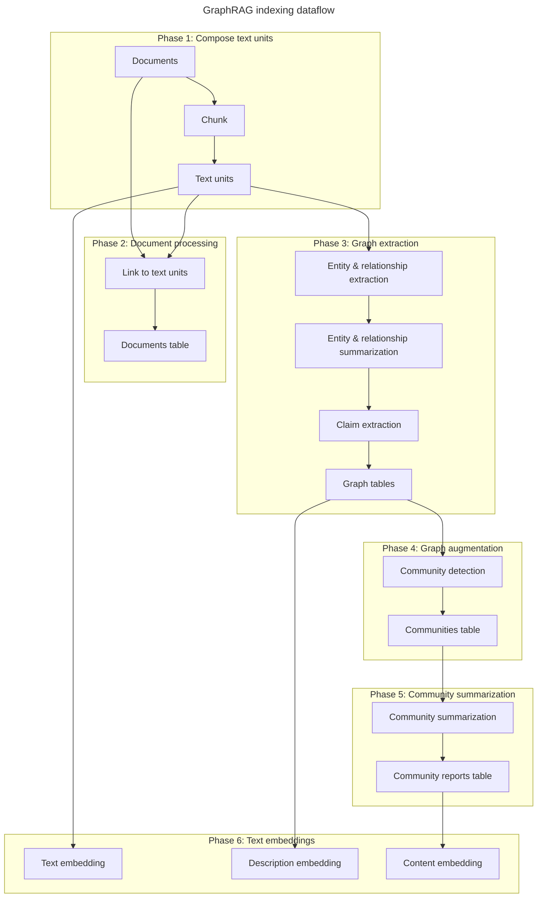

The GraphRAG indexing pipeline is a configurable data transformation suite that extracts meaningful, structured data from unstructured text using LLMs. The pipeline is composed of workflows, standard and custom steps, prompt templates, and input/output adapters.

## Pipeline overview

The indexing process transforms raw documents through six distinct phases:



## Phase 1: Compose text units

The first phase transforms input documents into analyzable text chunks called text units.

### Document loading

GraphRAG supports multiple input formats through configurable input readers:

<Tabs>
  <Tab title="Supported formats">
    **Built-in readers:**
    - **Text files** (.txt): Individual documents
    - **CSV files**: Rows as documents with configurable text columns
    - **JSON files**: Structured document collections
    
    **Custom readers:**
    You can implement custom input readers for other formats:
    ```python
    # Register a custom input reader
    from graphrag.index.input.factory import register_input_reader
    
    register_input_reader("my_format", MyCustomReader)
    ```
  </Tab>
  
  <Tab title="Configuration">
    Input configuration in your settings:
    
    ```yaml
    input:
      type: file  # or blob, cosmosdb
      file_type: text  # or csv, json
      base_dir: "./input"
      file_pattern: ".*\\.txt$"
      
      # For CSV
      source_column: "text"
      timestamp_column: "date"
      
      # For custom readers
      encoding: "utf-8"
    ```
  </Tab>
</Tabs>

### Text chunking

Documents are split into text units with configurable parameters:

<AccordionGroup>
  <Accordion title="Chunk size">
    **Default**: 1200 tokens
    
    The size of each text unit affects:
    - **Extraction quality**: Smaller chunks provide more focused extraction but may miss broader context
    - **Processing speed**: Larger chunks reduce the number of LLM calls but may be less precise
    - **Reference granularity**: Smaller chunks give finer-grained source citations
    
    ```yaml
    chunks:
      size: 1200  # tokens
      overlap: 100  # tokens
      group_by_columns: ["id"]  # optional: group chunks by document attributes
    ```
  </Accordion>
  
  <Accordion title="Overlap strategy">
    Text units can overlap to preserve context across chunk boundaries:
    
    - **No overlap**: Chunks are completely independent (faster, may miss boundary context)
    - **Moderate overlap** (100-200 tokens): Balances context preservation with efficiency
    - **High overlap** (300+ tokens): Maximum context but more redundancy and cost
    
    The overlap ensures entities or relationships spanning chunk boundaries are captured.
  </Accordion>
  
  <Accordion title="Implementation">
    Chunking is performed in the `create_base_text_units` workflow:
    
    ```python
    # Text units creation
    text_units = documents.chunk(
        size=chunk_size,
        overlap=chunk_overlap,
        encoding=token_encoder
    )
    ```
    
    Each text unit receives:
    - Unique ID
    - Text content
    - Token count
    - Document ID reference
    - Position in source document
  </Accordion>
</AccordionGroup>

<Note>
  Text units serve dual purposes: they are the analysis units for extraction AND the source references that enable provenance tracking.
</Note>

## Phase 2: Document processing

This phase creates the final documents table by linking documents to their constituent text units.

<Steps>
  <Step title="Document enrichment">
    Original document metadata is preserved:
    - Document ID
    - Title or filename
    - Timestamps (if available)
    - Custom attributes
  </Step>
  
  <Step title="Text unit linking">
    Each document is linked to all text units created from it:
    ```python
    document.text_unit_ids = ["unit_001", "unit_002", "unit_003"]
    ```
  </Step>
  
  <Step title="Table export">
    The documents table is exported as Parquet for downstream use and provenance.
  </Step>
</Steps>

## Phase 3: Graph extraction

This is the core knowledge extraction phase where entities, relationships, and claims are extracted from text units.

### Entity and relationship extraction

<Tabs>
  <Tab title="Workflow">
    The `extract_graph` workflow processes each text unit:
    
    ```python
    async def run_workflow(
        config: GraphRagConfig,
        context: PipelineRunContext,
    ) -> WorkflowFunctionOutput:
        text_units = await reader.text_units()
        
        # Extract entities and relationships
        entities, relationships, raw_entities, raw_relationships = await extract_graph(
            text_units=text_units,
            extraction_model=extraction_model,
            extraction_prompt=extraction_prompts.extraction_prompt,
            entity_types=config.extract_graph.entity_types,
            max_gleanings=config.extract_graph.max_gleanings,
        )
    ```
  </Tab>
  
  <Tab title="LLM interaction">
    For each text unit, the LLM receives:
    
    **Input:**
    - Text content
    - List of entity types to extract
    - Extraction instructions
    
    **Output:**
    - List of entities with title, type, description
    - List of relationships with source, target, description
    
    **Gleanings:** Optional iterative refinement passes (max_gleanings parameter)
  </Tab>
  
  <Tab title="Merging strategy">
    Entities and relationships from all text units are merged:
    
    **Entity merging:**
    - Same title + type → merge descriptions into list
    - Aggregate text_unit_ids
    - Preserve all unique information
    
    **Relationship merging:**
    - Same source + target → merge descriptions into list
    - Aggregate text_unit_ids
    - Combine weights
    
    ```python
    # Entities with same title and type are merged
    if len(extracted_entities) == 0:
        raise ValueError("No entities detected during extraction.")
    
    if len(extracted_relationships) == 0:
        raise ValueError("No relationships detected during extraction.")
    ```
  </Tab>
</Tabs>

### Summarization

After merging, entities and relationships have multiple descriptions that need consolidation:

<Info>
  Summarization reduces token counts and creates coherent, non-redundant descriptions for each entity and relationship.
</Info>

```python
async def get_summarized_entities_relationships(
    extracted_entities: pd.DataFrame,
    extracted_relationships: pd.DataFrame,
    model: LLMCompletion,
    max_summary_length: int,
    summarization_prompt: str,
) -> tuple[pd.DataFrame, pd.DataFrame]:
    """Summarize the entities and relationships."""
    entity_summaries, relationship_summaries = await summarize_descriptions(
        entities_df=extracted_entities,
        relationships_df=extracted_relationships,
        model=model,
        max_summary_length=max_summary_length,
        prompt=summarization_prompt,
    )
```

### Claim extraction

Optional workflow that extracts time-bound factual claims:

<Warning>
  Claim extraction is **disabled by default** and requires prompt tuning to be effective. Enable only when your use case specifically requires temporal claims.
</Warning>

<AccordionGroup>
  <Accordion title="FastGraphRAG mode">
    GraphRAG supports a FastGraphRAG option that uses NLP instead of LLMs for entity/relationship extraction:
    
    - **Faster processing**: No LLM calls for extraction
    - **Lower cost**: Only LLM calls for summarization and community reports
    - **Lower quality**: NLP extraction is less accurate than LLM extraction
    - **No claims**: Claim extraction is always skipped in FastGraphRAG mode
    
    Use FastGraphRAG when cost and speed are prioritized over extraction quality.
  </Accordion>
</AccordionGroup>

## Phase 4: Graph augmentation

This phase applies community detection to discover the organizational structure of the knowledge graph.

### Community detection workflow

The `create_communities` workflow applies hierarchical Leiden clustering:

```python
async def run_workflow(
    config: GraphRagConfig,
    context: PipelineRunContext,
) -> WorkflowFunctionOutput:
    relationships = await reader.relationships()
    
    clusters = cluster_graph(
        relationships,
        max_cluster_size=config.cluster_graph.max_cluster_size,
        use_lcc=config.cluster_graph.use_lcc,
        seed=config.cluster_graph.seed,
    )
```

<Tabs>
  <Tab title="Algorithm">
    **Hierarchical Leiden** is a community detection algorithm that:
    
    1. Treats the graph as undirected
    2. Applies Leiden clustering recursively
    3. Creates hierarchy until max_cluster_size is reached
    4. Produces multiple levels of granularity
    
    ```python
    def hierarchical_leiden(
        edges: list[tuple[str, str, float]],
        max_cluster_size: int = 10,
        random_seed: int | None = 0xDEADBEEF,
    ) -> list[HierarchicalCluster]:
        return gn.hierarchical_leiden(
            edges=edges,
            max_cluster_size=max_cluster_size,
            seed=random_seed,
            resolution=1.0,
            use_modularity=True,
        )
    ```
  </Tab>
  
  <Tab title="Configuration">
    Key parameters:
    
    ```yaml
    cluster_graph:
      max_cluster_size: 10  # Maximum entities per leaf community
      use_lcc: true  # Use largest connected component only
      seed: 0xDEADBEEF  # Random seed for reproducibility
    ```
    
    **max_cluster_size** affects:
    - Number of hierarchy levels
    - Granularity of communities
    - Community report detail
  </Tab>
  
  <Tab title="Output structure">
    Each community includes:
    
    ```python
    {
      "id": str,  # Unique community ID
      "level": int,  # Hierarchy level (0 = leaf)
      "title": str,  # "Community {number}"
      "entity_ids": list[str],  # Member entities
      "relationship_ids": list[str],  # Intra-community edges
      "text_unit_ids": list[str],  # Associated text units
      "parent": int,  # Parent community ID
      "children": list[int],  # Child community IDs
    }
    ```
  </Tab>
</Tabs>

### Largest connected component (LCC)

Optional preprocessing step:

<Info>
  When `use_lcc: true`, only the largest connected component of the graph is used for community detection. This filters out small disconnected clusters.
</Info>

## Phase 5: Community summarization

This phase generates human-readable summaries for each community.

### Report generation

The `create_community_reports` workflow creates summaries:

<Steps>
  <Step title="Gather community data">
    For each community, collect:
    - Entity descriptions
    - Relationship descriptions
    - Covariate/claim information (if available)
    - Text unit context
  </Step>
  
  <Step title="LLM summarization">
    The LLM generates a structured report including:
    - Executive summary
    - Key entities and their roles
    - Important relationships
    - Main themes and topics
    - Supporting claims
  </Step>
  
  <Step title="Report storage">
    Reports are stored with:
    - Full summary text
    - Summary embeddings (for global search)
    - Community metadata
    - Hierarchy information
  </Step>
</Steps>

<AccordionGroup>
  <Accordion title="Bottom-up approach">
    Community summarization proceeds from leaf communities upward:
    
    1. **Leaf level (level 0)**: Summarize individual entities and relationships
    2. **Mid levels**: Summarize child community reports
    3. **Root level**: Highest-level summary of entire dataset
    
    This creates coherent summaries at each granularity level.
  </Accordion>
  
  <Accordion title="Configuration">
    ```yaml
    community_reports:
      completion_model_id: "model-id"
      prompt: "community_report_prompt"
      max_length: 2000  # Max tokens for report
      max_input_tokens: 16000  # Context window for report generation
    ```
  </Accordion>
</AccordionGroup>

## Phase 6: Text embeddings

The final phase generates vector embeddings for semantic search.

### Embedding workflows

<CardGroup cols={3}>
  <Card title="Text unit embeddings" icon="file-lines">
    Embed the text content of each text unit for basic semantic search.
  </Card>
  <Card title="Entity embeddings" icon="circle-nodes">
    Embed entity descriptions for entity-based retrieval in local search.
  </Card>
  <Card title="Community report embeddings" icon="users">
    Embed community summaries for global search retrieval.
  </Card>
</CardGroup>

### Vector store integration

Embeddings are written to your configured vector store:

<Tabs>
  <Tab title="Supported stores">
    Built-in vector store implementations:
    - **LanceDB**: Local vector database
    - **Azure AI Search**: Cloud vector search service
    - **Azure Cosmos DB**: NoSQL database with vector search
    
    Custom vector stores can be registered via the factory pattern.
  </Tab>
  
  <Tab title="Configuration">
    ```yaml
    embeddings:
      vector_store:
        type: lancedb  # or azure_ai_search, cosmosdb
        
      text_unit:
        enabled: true
        embedding_model: "text-embedding-3-small"
        
      entity:
        enabled: true
        embedding_model: "text-embedding-3-small"
        
      community:
        enabled: true
        embedding_model: "text-embedding-3-small"
    ```
  </Tab>
</Tabs>

<Note>
  Embeddings enable the semantic similarity searches that serve as entry points into the knowledge graph during query time.
</Note>

## Pipeline architecture

The indexing engine is built on a flexible workflow system:

### Key architectural concepts

<AccordionGroup>
  <Accordion title="Workflows">
    Workflows are named sequences of operations that can be:
    - **Standard**: Built-in workflows like `extract_graph`, `create_communities`
    - **Custom**: User-defined workflows registered via the factory
    
    Each workflow:
    - Operates on tables from previous workflows
    - Produces output tables
    - Can be run independently or as part of pipeline
  </Accordion>
  
  <Accordion title="LLM caching">
    Critical for resilience and efficiency:
    
    - **Cache key**: Prompt + parameters uniquely identify requests
    - **Cache hit**: Returns stored result instead of API call
    - **Benefits**:
      - Resilience to network errors
      - Idempotent pipeline execution
      - Cost savings on reruns
    
    ```python
    # Cache layer wraps all LLM interactions
    model = create_completion(
        model_config,
        cache=context.cache.child("extract_graph"),
        cache_key_creator=cache_key_creator,
    )
    ```
  </Accordion>
  
  <Accordion title="Factory pattern">
    GraphRAG uses factories for extensibility:
    
    - **Language models**: Custom model providers
    - **Input readers**: Custom document formats
    - **Cache**: Custom cache storage
    - **Storage**: Custom table storage
    - **Vector stores**: Custom vector databases
    - **Workflows**: Custom pipeline steps
    
    Register custom implementations:
    ```python
    from graphrag.vector_stores.factory import register_vector_store
    
    register_vector_store("my_store", MyVectorStore)
    ```
  </Accordion>
</AccordionGroup>

## Running the indexing pipeline

<Tabs>
  <Tab title="CLI">
    ```bash
    # Run with default configuration
    uv run poe index --root <data_root>
    
    # With custom config
    uv run poe index --root <data_root> --config custom_config.yaml
    
    # Resume from cache
    uv run poe index --root <data_root> --resume
    ```
  </Tab>
  
  <Tab title="Python API">
    ```python
    from graphrag.api.index import build_index
    
    # Run indexing programmatically
    await build_index(
        config=config,
        root_dir=root_dir,
        resume=False,
    )
    ```
  </Tab>
</Tabs>

## Best practices

<CardGroup cols={2}>
  <Card title="Start small" icon="seedling">
    Test with a small dataset first to understand costs, processing time, and output quality before scaling up.
  </Card>
  <Card title="Monitor extraction" icon="chart-line">
    Check entity and relationship counts after Phase 3. Low numbers indicate prompt tuning may be needed.
  </Card>
  <Card title="Tune prompts" icon="sliders">
    Use the prompt tuning process to optimize extraction for your domain before processing large datasets.
  </Card>
  <Card title="Configure caching" icon="database">
    Ensure LLM caching is enabled and properly configured to handle network issues and enable reruns.
  </Card>
</CardGroup>

## Next steps

<CardGroup cols={2}>
  <Card title="Community detection" href="/concepts/community-detection" icon="users">
    Deep dive into hierarchical Leiden clustering
  </Card>
  <Card title="Retrieval methods" href="/concepts/retrieval-methods" icon="magnifying-glass">
    Learn how indexed data powers different search strategies
  </Card>
</CardGroup>