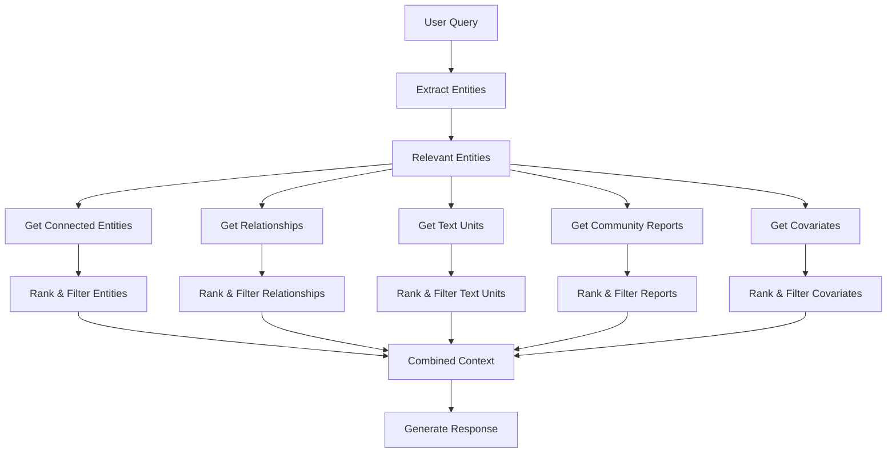

GraphRAG provides multiple retrieval strategies, each optimized for different types of questions. Understanding when to use each method is key to getting the best results from your knowledge graph.

## Overview of retrieval methods

Unlike traditional RAG systems that rely solely on semantic similarity, GraphRAG offers four distinct search approaches:

<CardGroup cols={2}>
  <Card title="Global search" icon="globe">
    **Best for**: Dataset-wide questions requiring holistic understanding
    
    Uses community summaries to reason about themes, trends, and high-level patterns across the entire corpus.
  </Card>
  
  <Card title="Local search" icon="location-dot">
    **Best for**: Entity-specific questions requiring detailed information
    
    Combines knowledge graph structure with text chunks to gather comprehensive information about specific entities.
  </Card>
  
  <Card title="DRIFT search" icon="compass">
    **Best for**: Exploratory queries needing both breadth and depth
    
    Dynamically combines global and local approaches through iterative question refinement.
  </Card>
  
  <Card title="Basic search" icon="magnifying-glass">
    **Best for**: Simple semantic similarity queries
    
    Traditional top-k vector search over text units when graph structure isn't needed.
  </Card>
</CardGroup>

## Global search

Global search addresses a critical weakness in baseline RAG: answering questions that require holistic understanding of an entire dataset.

### When to use global search

<Tabs>
  <Tab title="Ideal queries">
    **Thematic questions:**
    - "What are the top 5 themes in this data?"
    - "What are the main trends discussed?"
    - "Summarize the overall narrative"
    
    **Aggregation questions:**
    - "What are the most significant findings?"
    - "What patterns emerge across the dataset?"
    - "What are the key takeaways?"
    
    **Comparison questions:**
    - "What are the major differences between X and Y?"
    - "How do various perspectives compare?"
    - "What are the competing viewpoints?"
  </Tab>
  
  <Tab title="Why baseline RAG fails">
    Traditional vector search struggles with these queries because:
    
    1. **No semantic anchor**: Questions like "What are the top themes?" don't match specific text chunks
    2. **Requires synthesis**: Answers need information from across the entire dataset
    3. **No single source**: No individual chunk contains the complete answer
    4. **Structural understanding**: Need to understand how the dataset is organized
    
    <Info>
      GraphRAG solves this by using the knowledge graph structure itself to understand dataset organization.
    </Info>
  </Tab>
</Tabs>

### How global search works

<Steps>
  <Step title="Select community level">
    Choose which hierarchy level to use based on desired granularity:
    
    - **Root level**: Fastest, most abstract (2-5 communities)
    - **Mid level**: Balanced detail and coverage
    - **Leaf level**: Most comprehensive, slowest (hundreds of communities)
    
    ```python
    # Configuration
    context_builder_params = {
        "community_level": 2,  # Choose hierarchy level
    }
    ```
  </Step>
  
  <Step title="Map phase">
    Community reports are processed in parallel:
    
    1. **Chunk reports**: Split reports into token-sized chunks
    2. **Generate intermediate responses**: Each chunk produces a list of points with importance ratings
    3. **Rate points**: LLM assigns 1-10 importance scores to each point
    
    ```mermaid
    flowchart LR
        uq[User Query] --> batch1[Community Reports Batch 1]
        uq --> batch2[Community Reports Batch 2]
        uq --> batchN[Community Reports Batch N]
        batch1 --> ir1[Intermediate Response 1]
        batch2 --> ir2[Intermediate Response 2]
        batchN --> irN[Intermediate Response N]
    ```
  </Step>
  
  <Step title="Reduce phase">
    Aggregate intermediate responses:
    
    1. **Rank points**: Sort all points by importance rating
    2. **Filter**: Keep only highest-rated points that fit in context window
    3. **Synthesize**: LLM generates final response from aggregated points
    
    The final response is a comprehensive answer drawing from across the dataset.
  </Step>
</Steps>

### Configuration

<AccordionGroup>
  <Accordion title="Core parameters">
    ```python
    from graphrag.query.structured_search.global_search import GlobalSearch
    
    search = GlobalSearch(
        model=model,  # LLM for generation
        context_builder=context_builder,  # Community report builder
        
        # Prompts
        map_system_prompt=map_prompt,  # Map phase instructions
        reduce_system_prompt=reduce_prompt,  # Reduce phase instructions
        
        # Response configuration
        response_type="Multiple Paragraphs",  # Or "Multi-Page Report"
        
        # Token budget
        max_data_tokens=8000,  # Context window for community reports
        
        # LLM parameters
        map_llm_params={"temperature": 0.0, "max_tokens": 1000},
        reduce_llm_params={"temperature": 0.0, "max_tokens": 2000},
        
        # Parallelism
        concurrent_coroutines=10,  # Parallel map operations
    )
    ```
  </Accordion>
  
  <Accordion title="Advanced options">
    **General knowledge integration:**
    ```python
    search = GlobalSearch(
        # ...
        allow_general_knowledge=True,  # Include real-world knowledge
        general_knowledge_inclusion_prompt=knowledge_prompt,
    )
    ```
    
    - **True**: LLM can incorporate external knowledge beyond dataset
    - **False** (default): Responses strictly from indexed data
    
    <Warning>
      Enabling general knowledge may increase hallucinations but can be useful for context-setting or filling gaps.
    </Warning>
    
    **Context builder parameters:**
    ```python
    context_builder_params = {
        "community_level": 2,  # Hierarchy level to use
        "use_community_summary": True,  # Include community summaries
        "shuffle_data": True,  # Randomize report order (reduces position bias)
        "include_community_rank": True,  # Weight by community importance
    }
    ```
  </Accordion>
  
  <Accordion title="Performance vs quality trade-offs">
    **Hierarchy level selection:**
    
    | Level | Communities | Speed | Detail | Cost |
    |-------|-------------|-------|--------|------|
    | Root (top) | 2-5 | Fastest | Lowest | Lowest |
    | Mid | 10-50 | Medium | Medium | Medium |
    | Leaf (0) | 100-1000 | Slowest | Highest | Highest |
    
    **Token budget:**
    - **Lower** (4000-8000): Faster, less comprehensive
    - **Higher** (12000-16000): Slower, more comprehensive
    
    **Concurrent coroutines:**
    - **Higher** (20-50): Faster map phase, more API load
    - **Lower** (5-10): Slower but more stable
  </Accordion>
</AccordionGroup>

## Local search

Local search excels at answering questions about specific entities by combining structured graph knowledge with unstructured text.

### When to use local search

<Tabs>
  <Tab title="Ideal queries">
    **Entity-specific questions:**
    - "What are the healing properties of chamomile?"
    - "Who is Satya Nadella and what is his role?"
    - "Describe the relationship between X and Y"
    
    **Detailed information needs:**
    - "What does the research say about [specific topic]?"
    - "What are the characteristics of [entity]?"
    - "How is [entity] connected to [other entities]?"
    
    **Multi-hop reasoning:**
    - "How are A and B related through C?"
    - "What do A's connections say about B?"
  </Tab>
  
  <Tab title="Advantages over baseline RAG">
    Local search improves on vector search by:
    
    1. **Structured traversal**: Follows relationship edges, not just text similarity
    2. **Multi-hop paths**: Can connect entities through intermediate nodes
    3. **Entity disambiguation**: Uses graph structure to resolve entity references
    4. **Community context**: Includes broader thematic context from communities
    5. **Comprehensive gathering**: Combines descriptions, relationships, text chunks, and claims
  </Tab>
</Tabs>

### How local search works



<Steps>
  <Step title="Entity extraction">
    Identify entities relevant to the query:
    
    1. **Embed query**: Convert query to vector embedding
    2. **Search entity embeddings**: Find semantically similar entities
    3. **Rank by similarity**: Top-k entities become entry points
    
    ```python
    # Entity extraction via embedding similarity
    extracted_entities = entity_extraction(
        query=query,
        entity_descriptions=entity_descriptions,
        embedding_model=embedding_model,
        top_k=top_k_entities,
    )
    ```
  </Step>
  
  <Step title="Graph traversal">
    Fan out from seed entities to gather related information:
    
    **Connected entities:**
    - Direct neighbors (1-hop)
    - Optionally: 2-hop neighbors
    - Ranked by relationship strength and centrality
    
    **Relationships:**
    - All edges connected to seed entities
    - Edges between gathered entities
    - Ranked by weight and relevance
    
    **Community reports:**
    - Reports for communities containing seed entities
    - Reports for related entities' communities
    - Provides thematic context
  </Step>
  
  <Step title="Text unit retrieval">
    Gather source text:
    
    1. **Entity-text mappings**: Text units mentioning extracted entities
    2. **Rank by relevance**: Score text units by:
       - Entity importance
       - Number of relevant entities mentioned
       - Semantic similarity to query
    3. **Filter by token budget**: Keep top-ranked units that fit
  </Step>
  
  <Step title="Covariate retrieval">
    If claims are available:
    
    1. **Entity-claim mappings**: Claims about extracted entities
    2. **Rank by relevance**: Score claims by entity importance and claim type
    3. **Include in context**: Add to structured context
  </Step>
  
  <Step title="Context assembly">
    Combine all components into structured context:
    
    ```
    # Entities
    - Entity 1: [description]
    - Entity 2: [description]
    
    # Relationships
    - Entity 1 -> Entity 2: [relationship description]
    
    # Community Reports
    - Community X: [summary]
    
    # Sources
    - Text Unit 1: [text]
    - Text Unit 2: [text]
    
    # Claims
    - Claim about Entity 1: [description]
    ```
  </Step>
  
  <Step title="Response generation">
    LLM generates answer using the structured context:
    
    - Answers drawn from multiple sources
    - Maintains provenance (can cite entities, relationships, text units)
    - Balances graph structure with text details
  </Step>
</Steps>

### Configuration

<AccordionGroup>
  <Accordion title="Core parameters">
    ```python
    from graphrag.query.structured_search.local_search import LocalSearch
    
    search = LocalSearch(
        model=model,  # LLM for generation
        context_builder=context_builder,  # Mixed context builder
        
        # Prompt
        system_prompt=system_prompt,  # Instructions for response generation
        
        # Response configuration
        response_type="Multiple Paragraphs",
        
        # LLM parameters
        llm_params={"temperature": 0.0, "max_tokens": 2000},
    )
    ```
  </Accordion>
  
  <Accordion title="Context builder parameters">
    Fine-tune what gets included:
    
    ```python
    context_builder_params = {
        # Entity settings
        "text_unit_prop": 0.5,  # Proportion of budget for text units
        "community_prop": 0.25,  # Proportion for community reports
        "conversation_history_max_turns": 5,  # Conversation context
        "top_k_entities": 10,  # Seed entities from query
        
        # Graph traversal
        "include_entity_rank": True,  # Weight by entity importance
        "include_relationship_weight": True,  # Use relationship weights
        "rank_description": True,  # Rank entities by description relevance
        
        # Community context
        "include_community_rank": True,  # Weight community reports
        "use_community_summary": True,  # Include summaries
        
        # Token management
        "max_tokens": 8000,  # Total context budget
    }
    ```
  </Accordion>
  
  <Accordion title="Ranking and filtering">
    How candidates are prioritized:
    
    **Entity ranking:**
    1. Embedding similarity to query
    2. Graph centrality (degree, PageRank)
    3. Community membership importance
    
    **Relationship ranking:**
    1. Connected to high-ranked entities
    2. Relationship weight
    3. Description relevance to query
    
    **Text unit ranking:**
    1. Contains high-ranked entities
    2. Number of relevant entities
    3. Semantic similarity to query
    
    **Community report ranking:**
    1. Contains seed entities
    2. Community size and importance
    3. Summary relevance
  </Accordion>
</AccordionGroup>

## DRIFT search

DRIFT (Dynamic Reasoning and Inference with Flexible Traversal) combines the breadth of global search with the depth of local search through iterative refinement.

### How DRIFT search works

<div style={{textAlign: 'center', margin: '2rem 0'}}>
  <p style={{fontSize: '0.9rem', color: '#666'}}>DRIFT search creates a hierarchical exploration tree with three phases: Primer (global), Follow-up (local), and Output (ranked hierarchy)</p>
</div>

<Steps>
  <Step title="Primer phase">
    Start with global community context:
    
    1. **Retrieve top-k community reports**: Most relevant to query
    2. **Generate initial answer**: Broad response addressing the query
    3. **Generate follow-up questions**: Questions for deeper exploration
    4. **Confidence scoring**: Rate each follow-up question's potential
  </Step>
  
  <Step title="Follow-up phase">
    Iteratively refine through local search:
    
    1. **Select highest-confidence question**: From pending follow-ups
    2. **Execute local search**: Detailed entity-based search
    3. **Generate intermediate answer**: Specific response to follow-up
    4. **Generate new follow-ups**: Further refinement questions
    5. **Update confidence**: Re-score based on information gain
    6. **Repeat**: Until budget exhausted or confidence threshold not met
  </Step>
  
  <Step title="Output hierarchy">
    Produce structured result:
    
    ```
    Question: [Original query]
    └── Global Answer: [Broad response]
        ├── Follow-up 1: [Refined question]
        │   └── Local Answer: [Detailed response]
        │       └── Follow-up 1.1: [Further refinement]
        │           └── Local Answer: [More detail]
        └── Follow-up 2: [Alternative angle]
            └── Local Answer: [Detailed response]
    ```
    
    Ranked by relevance for user exploration.
  </Step>
</Steps>

### When to use DRIFT search

<Tabs>
  <Tab title="Ideal scenarios">
    **Exploratory queries:**
    - "Tell me about [broad topic]"
    - "What should I know about [domain]?"
    - "Explain [complex concept]"
    
    **Unknown unknowns:**
    - User doesn't know specific entities to ask about
    - Investigating unfamiliar dataset
    - Discovery-oriented exploration
    
    **Balanced needs:**
    - Need both overview and details
    - Want multiple perspectives
    - Seeking comprehensive understanding
  </Tab>
  
  <Tab title="Advantages">
    **Combines best of both:**
    - Global search provides breadth and themes
    - Local search provides depth and specifics
    - Iterative refinement follows promising paths
    
    **Adaptive exploration:**
    - Confidence scoring guides investigation
    - Automatically balances breadth vs depth
    - Stops when information gain plateaus
    
    **Structured output:**
    - Hierarchical question-answer tree
    - Ranked by relevance
    - Easy to navigate results
  </Tab>
</Tabs>

### Configuration

```python
from graphrag.query.structured_search.drift_search import DRIFTSearch
from graphrag.config.models.drift_search_config import DRIFTSearchConfig

config = DRIFTSearchConfig(
    # Primer phase
    primer_folds=3,  # How many community report folds to use
    primer_allow_general_knowledge=False,
    
    # Follow-up phase
    follow_up_max_iterations=3,  # Max follow-up depth
    follow_up_confidence_threshold=0.7,  # Min confidence to continue
    
    # Token budgets
    local_search_text_unit_prop=0.5,
    local_search_community_prop=0.25,
    
    # LLM parameters
    temperature=0.0,
    max_tokens=2000,
)

search = DRIFTSearch(
    model=model,
    context_builder=context_builder,
    config=config,
    tokenizer=tokenizer,
)
```

<AccordionGroup>
  <Accordion title="Key hyperparameters">
    **primer_folds**: Number of community report batches
    - Higher → more comprehensive initial coverage
    - Lower → faster primer phase
    
    **follow_up_max_iterations**: Maximum refinement depth
    - Higher → more detailed exploration
    - Lower → faster, less thorough
    
    **follow_up_confidence_threshold**: Minimum confidence to continue
    - Higher (0.8-0.9) → only high-value follow-ups
    - Lower (0.5-0.7) → more exploratory
    
    <Info>
      DRIFT automatically balances exploration depth with computational cost using confidence scoring.
    </Info>
  </Accordion>
</AccordionGroup>

## Basic search

Traditional top-k vector similarity search over text units.

### When to use basic search

- Simple fact lookup questions
- Queries with direct semantic matches in text
- When graph structure doesn't add value
- Baseline comparison for other methods

```python
# Basic search configuration
basic_search_params = {
    "top_k": 5,  # Number of text units to retrieve
    "embedding_model": "text-embedding-3-small",
}
```

<Note>
  Basic search is included primarily for comparison and simple use cases. Most queries benefit from local or global search.
</Note>

## Choosing the right method

<Tabs>
  <Tab title="Decision tree">
    ```
    Is the question about the dataset as a whole?
    ├─ Yes → Global Search
    │   - Themes, trends, top items
    │   - Dataset-wide summaries
    │   - Comparative analysis across corpus
    │
    └─ No → Is it about specific entities?
        ├─ Yes → Local Search
        │   - Entity attributes and relationships
        │   - Detailed information needs
        │   - Multi-hop reasoning
        │
        └─ No → Is it exploratory?
            ├─ Yes → DRIFT Search
            │   - Broad topic investigation
            │   - Unknown information needs
            │   - Comprehensive understanding
            │
            └─ No → Basic Search
                - Simple fact lookup
                - Direct semantic match
    ```
  </Tab>
  
  <Tab title="By use case">
    | Use Case | Best Method | Why |
    |----------|-------------|-----|
    | "What are the main themes?" | Global | Requires dataset-wide understanding |
    | "What does entity X do?" | Local | Specific entity information |
    | "Tell me about topic Y" | DRIFT | Exploratory, needs breadth and depth |
    | "Find mentions of Z" | Basic | Simple semantic search |
    | "Compare A and B" | Local | Specific entities and relationships |
    | "Summarize the data" | Global | Holistic overview |
    | "How are A and B connected?" | Local | Multi-hop graph traversal |
    | "What's important here?" | DRIFT | Discovery-oriented |
  </Tab>
  
  <Tab title="By characteristics">
    **Global Search:**
    - ✓ Dataset-wide questions
    - ✓ Abstract/thematic queries
    - ✓ No specific entities mentioned
    - ✗ Detailed entity information
    - ✗ Specific fact lookup
    
    **Local Search:**
    - ✓ Named entity questions
    - ✓ Relationship traversal
    - ✓ Detailed information needs
    - ✗ Dataset-wide themes
    - ✗ Abstract summaries
    
    **DRIFT Search:**
    - ✓ Exploratory queries
    - ✓ Unknown information needs
    - ✓ Balanced breadth/depth
    - ✗ Time-sensitive (slower)
    - ✗ Simple fact lookup
    
    **Basic Search:**
    - ✓ Simple semantic match
    - ✓ Fast baseline
    - ✗ Complex reasoning
    - ✗ Graph structure needed
  </Tab>
</Tabs>

## Performance considerations

<CardGroup cols={2}>
  <Card title="Speed" icon="gauge-high">
    **Fastest to slowest:**
    1. Basic search
    2. Local search
    3. Global search (root level)
    4. Global search (leaf level)
    5. DRIFT search
  </Card>
  
  <Card title="Cost" icon="dollar-sign">
    **LLM token usage:**
    - Basic: Minimal (generation only)
    - Local: Moderate (one generation call)
    - Global: High (map-reduce = many calls)
    - DRIFT: Highest (global + multiple local)
  </Card>
  
  <Card title="Quality" icon="star">
    **For appropriate query types:**
    - Global: Excellent for themes
    - Local: Excellent for entities
    - DRIFT: Excellent for exploration
    - Basic: Good for simple facts
  </Card>
  
  <Card title="Scalability" icon="chart-line">
    **Large datasets:**
    - Basic: Scales well (vector search)
    - Local: Scales moderately (graph size)
    - Global: Depends on hierarchy level
    - DRIFT: Resource-intensive
  </Card>
</CardGroup>

## Best practices

<AccordionGroup>
  <Accordion title="Start with the right method">
    Don't default to one method:
    - Analyze the query type
    - Consider information needs
    - Choose appropriate method
    - Evaluate results
  </Accordion>
  
  <Accordion title="Tune for your use case">
    - **Global**: Adjust community level based on detail needs
    - **Local**: Tune context proportions for your data
    - **DRIFT**: Balance exploration depth with cost
    - **All**: Optimize token budgets
  </Accordion>
  
  <Accordion title="Combine methods">
    Consider hybrid approaches:
    - Try local first, fall back to global
    - Use basic search for filtering, then local for details
    - DRIFT for exploration, local for follow-up
  </Accordion>
  
  <Accordion title="Monitor performance">
    Track metrics:
    - Query latency
    - Token usage and cost
    - Result quality (user feedback)
    - Adjust parameters accordingly
  </Accordion>
</AccordionGroup>

## Next steps

<CardGroup cols={2}>
  <Card title="Get started guide" href="/quickstart" icon="rocket">
    Set up GraphRAG and run your first queries
  </Card>
  <Card title="Configuration" href="/configuration/overview" icon="gears">
    Configure retrieval parameters for your use case
  </Card>
</CardGroup>