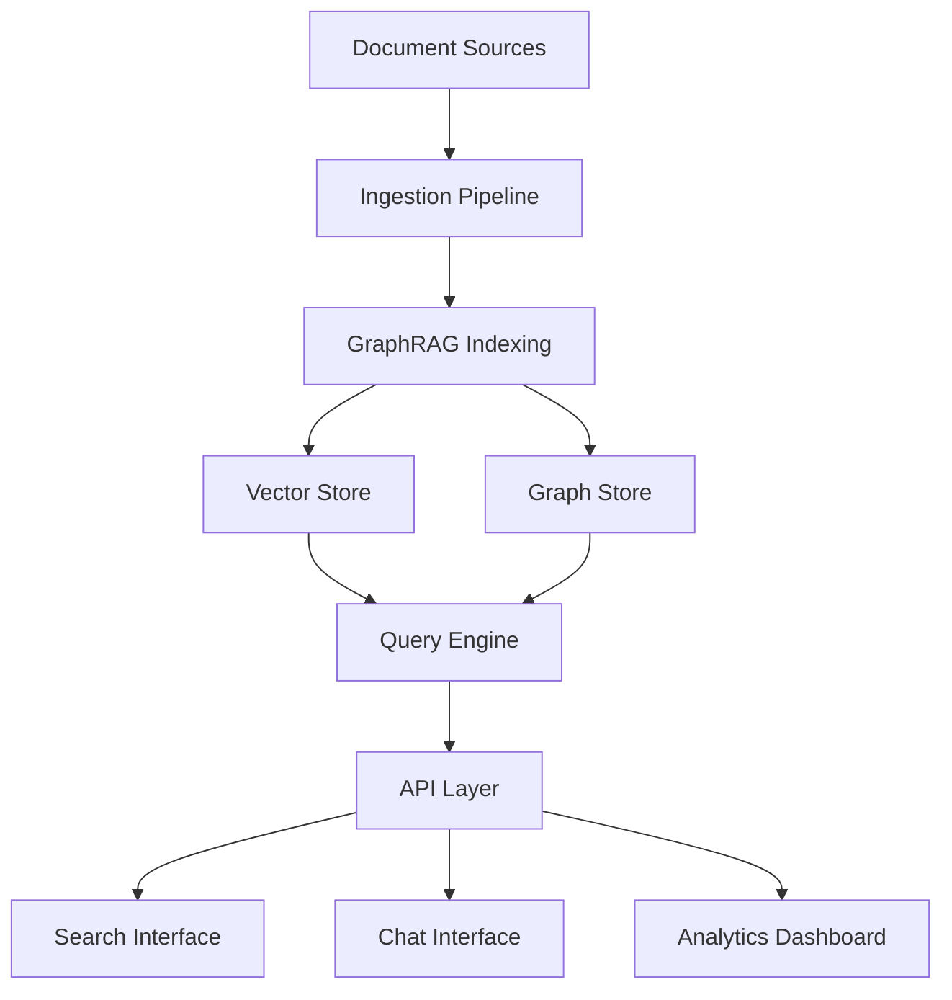

GraphRAG enables organizations to build intelligent knowledge management systems that transform scattered documents and data into accessible, queryable knowledge graphs.

## Enterprise use cases

GraphRAG supports various enterprise knowledge management scenarios:

<CardGroup cols={2}>
  <Card title="Internal documentation" icon="book">
    Process wikis, policies, procedures, and guidelines
  </Card>
  
  <Card title="Customer support" icon="headset">
    Knowledge bases, FAQs, troubleshooting guides
  </Card>
  
  <Card title="Legal & compliance" icon="scale-balanced">
    Contracts, regulations, compliance documents
  </Card>
  
  <Card title="Corporate intelligence" icon="chart-line">
    Market research, competitive analysis, reports
  </Card>
  
  <Card title="Technical documentation" icon="code">
    API docs, architecture guides, runbooks
  </Card>
  
  <Card title="Institutional knowledge" icon="graduation-cap">
    Training materials, best practices, lessons learned
  </Card>
</CardGroup>

## Architecture for enterprise deployment

### System components



### Deployment configuration

<Steps>
  <Step title="Set up Azure infrastructure">
    Deploy using Azure services for enterprise scale:
    
    ```bash
    # Resource group
    az group create --name graphrag-enterprise --location eastus
    
    # Azure OpenAI
    az cognitiveservices account create \
      --name graphrag-openai \
      --resource-group graphrag-enterprise \
      --kind OpenAI \
      --sku S0
    
    # Azure Blob Storage
    az storage account create \
      --name graphragdocs \
      --resource-group graphrag-enterprise \
      --sku Standard_LRS
    
    # Cosmos DB (optional, for graph storage)
    az cosmosdb create \
      --name graphrag-cosmos \
      --resource-group graphrag-enterprise
    ```
  </Step>

  <Step title="Configure data ingestion">
    Set up automated document ingestion:
    
    ```yaml settings.yaml
    input:
      storage:
        type: blob
        connection_string: ${AZURE_STORAGE_CONNECTION_STRING}
        container_name: source-documents
      type: csv
      file_pattern: .*\.(txt|pdf|docx)$
    
    chunking:
      size: 500
      overlap: 100
      prepend_metadata: ["source", "department", "last_updated", "owner"]
    
    output:
      type: blob
      connection_string: ${AZURE_STORAGE_CONNECTION_STRING}
      container_name: knowledge-graph
    ```
  </Step>

  <Step title="Set up automated indexing">
    Create scheduled indexing with Azure Functions:
    
    ```python
    # function_app.py
    import azure.functions as func
    import graphrag.api as api
    from pathlib import Path
    
    app = func.FunctionApp()
    
    @app.schedule(schedule="0 0 2 * * *", arg_name="timer")
    async def nightly_indexing(timer: func.TimerRequest):
        """Run GraphRAG indexing every night at 2 AM."""
        
        config = load_config(Path("/config"))
        
        # Run indexing
        result = await api.build_index(config=config)
        
        # Log results
        for workflow in result:
            status = "success" if not workflow.errors else "error"
            logging.info(f"Workflow {workflow.workflow}: {status}")
    ```
  </Step>

  <Step title="Deploy query API">
    Create scalable API with Azure Container Apps:
    
    ```dockerfile
    FROM python:3.11-slim
    
    WORKDIR /app
    
    COPY requirements.txt .
    RUN pip install -r requirements.txt
    
    COPY app/ ./app/
    
    EXPOSE 8000
    
    CMD ["uvicorn", "app.main:app", "--host", "0.0.0.0", "--port", "8000"]
    ```
    
    Deploy:
    ```bash
    az containerapp create \
      --name graphrag-api \
      --resource-group graphrag-enterprise \
      --image graphrag-api:latest \
      --target-port 8000 \
      --ingress external \
      --min-replicas 2 \
      --max-replicas 10
    ```
  </Step>
</Steps>

## Multi-tenant knowledge management

For organizations with multiple departments or business units:

### Tenant isolation

```python
from typing import Optional
import pandas as pd

class TenantKnowledgeGraph:
    """Manage knowledge graphs for multiple tenants."""
    
    def __init__(self, base_path: str):
        self.base_path = base_path
        self.tenant_configs = {}
    
    def get_tenant_data(self, tenant_id: str, table_name: str) -> pd.DataFrame:
        """Load data for specific tenant."""
        path = f"{self.base_path}/{tenant_id}/output/{table_name}.parquet"
        return pd.read_parquet(path)
    
    async def query(self, tenant_id: str, query: str, method: str = "local"):
        """Query specific tenant's knowledge graph."""
        
        # Load tenant-specific data
        entities = self.get_tenant_data(tenant_id, "entities")
        communities = self.get_tenant_data(tenant_id, "communities")
        reports = self.get_tenant_data(tenant_id, "community_reports")
        
        # Get tenant config
        config = self.tenant_configs.get(tenant_id)
        
        if method == "global":
            response, context = await api.global_search(
                config=config,
                entities=entities,
                communities=communities,
                community_reports=reports,
                query=query
            )
        else:
            relationships = self.get_tenant_data(tenant_id, "relationships")
            text_units = self.get_tenant_data(tenant_id, "text_units")
            
            response, context = await api.local_search(
                config=config,
                entities=entities,
                communities=communities,
                community_reports=reports,
                relationships=relationships,
                text_units=text_units,
                query=query
            )
        
        return response, context

# Usage
kg = TenantKnowledgeGraph("/data/tenants")

# Query for HR department
response, _ = await kg.query(
    tenant_id="hr",
    query="What is the vacation policy?",
    method="local"
)

# Query for engineering department  
response, _ = await kg.query(
    tenant_id="engineering",
    query="What are our deployment procedures?",
    method="local"
)
```

### Cross-tenant search

```python
async def search_across_tenants(
    tenants: list[str],
    query: str,
    method: str = "local"
) -> dict[str, str]:
    """Search across multiple tenants and aggregate results."""
    
    results = {}
    
    for tenant_id in tenants:
        try:
            response, _ = await kg.query(tenant_id, query, method)
            results[tenant_id] = response
        except Exception as e:
            results[tenant_id] = f"Error: {str(e)}"
    
    return results

# Search HR, Legal, and Finance
results = await search_across_tenants(
    tenants=["hr", "legal", "finance"],
    query="What are the requirements for vendor contracts?"
)

for dept, answer in results.items():
    print(f"\n{dept.upper()}:")
    print(answer)
```

## Access control and security

### Role-based access

```python
from enum import Enum
from typing import Set

class Role(Enum):
    ADMIN = "admin"
    MANAGER = "manager"
    EMPLOYEE = "employee"
    CONTRACTOR = "contractor"

class AccessControl:
    """Manage access to knowledge based on roles."""
    
    def __init__(self):
        self.role_permissions = {
            Role.ADMIN: {"all"},
            Role.MANAGER: {"public", "internal", "department"},
            Role.EMPLOYEE: {"public", "internal"},
            Role.CONTRACTOR: {"public"},
        }
    
    def filter_entities(
        self,
        entities: pd.DataFrame,
        user_role: Role
    ) -> pd.DataFrame:
        """Filter entities based on user role."""
        
        allowed_classifications = self.role_permissions[user_role]
        
        # Filter based on classification metadata
        if "classification" in entities.columns:
            mask = entities["classification"].isin(allowed_classifications)
            return entities[mask]
        
        return entities
    
    async def secure_query(
        self,
        query: str,
        user_role: Role,
        method: str = "local"
    ):
        """Perform query with access control."""
        
        # Load data
        entities = pd.read_parquet("./output/entities.parquet")
        
        # Filter based on permissions
        entities = self.filter_entities(entities, user_role)
        
        # Proceed with query on filtered data
        # ... query implementation

# Usage
access_control = AccessControl()

response = await access_control.secure_query(
    query="What are the executive compensation policies?",
    user_role=Role.EMPLOYEE  # Will only see public/internal docs
)
```

### Document classification

```yaml
# Add classification metadata during indexing
input:
  type: csv
  metadata_fields:
    - classification  # public, internal, confidential, restricted
    - department
    - owner
    - last_reviewed
```

## Integration patterns

### SharePoint integration

```python
from office365.sharepoint.client_context import ClientContext
from office365.runtime.auth.client_credential import ClientCredential
import pandas as pd

class SharePointConnector:
    """Sync documents from SharePoint to GraphRAG."""
    
    def __init__(self, site_url: str, client_id: str, client_secret: str):
        credentials = ClientCredential(client_id, client_secret)
        self.ctx = ClientContext(site_url).with_credentials(credentials)
    
    def get_documents(self, library: str) -> pd.DataFrame:
        """Retrieve documents from SharePoint library."""
        
        # Get document library
        doc_lib = self.ctx.web.lists.get_by_title(library)
        items = doc_lib.items.get().execute_query()
        
        # Convert to DataFrame
        docs = []
        for item in items:
            docs.append({
                "id": item.properties["Id"],
                "title": item.properties["Title"],
                "content": self.get_file_content(item),
                "modified": item.properties["Modified"],
                "author": item.properties["Author"]["Title"],
            })
        
        return pd.DataFrame(docs)
    
    def sync_to_graphrag(self, library: str, output_path: str):
        """Sync SharePoint docs to GraphRAG input."""
        
        docs = self.get_documents(library)
        docs.to_csv(f"{output_path}/documents.csv", index=False)

# Usage
connector = SharePointConnector(
    site_url="https://company.sharepoint.com/sites/knowledge",
    client_id=os.getenv("SHAREPOINT_CLIENT_ID"),
    client_secret=os.getenv("SHAREPOINT_CLIENT_SECRET")
)

connector.sync_to_graphrag("Company Policies", "./input")
```

### Confluence integration

```python
from atlassian import Confluence

class ConfluenceConnector:
    """Sync pages from Confluence to GraphRAG."""
    
    def __init__(self, url: str, username: str, api_token: str):
        self.confluence = Confluence(
            url=url,
            username=username,
            password=api_token
        )
    
    def get_space_content(self, space_key: str) -> pd.DataFrame:
        """Get all pages from a Confluence space."""
        
        pages = self.confluence.get_all_pages_from_space(
            space_key,
            start=0,
            limit=500,
            expand="body.storage,version,metadata.labels"
        )
        
        docs = []
        for page in pages:
            docs.append({
                "id": page["id"],
                "title": page["title"],
                "content": page["body"]["storage"]["value"],
                "space": space_key,
                "version": page["version"]["number"],
                "labels": ",".join([l["name"] for l in page["metadata"]["labels"]["results"]]),
            })
        
        return pd.DataFrame(docs)

# Usage
confluence = ConfluenceConnector(
    url="https://company.atlassian.net/wiki",
    username="user@company.com",
    api_token=os.getenv("CONFLUENCE_API_TOKEN")
)

docs = confluence.get_space_content("ENG")  # Engineering space
docs.to_csv("./input/confluence_docs.csv", index=False)
```

### Slack integration

```python
from slack_sdk import WebClient

class SlackKnowledgeExtractor:
    """Extract knowledge from Slack conversations."""
    
    def __init__(self, token: str):
        self.client = WebClient(token=token)
    
    def get_channel_threads(self, channel_id: str, days: int = 30):
        """Get valuable threads from a channel."""
        
        # Get messages
        result = self.client.conversations_history(
            channel=channel_id,
            oldest=time.time() - (days * 86400)
        )
        
        # Filter for threads with high engagement
        valuable_threads = []
        for message in result["messages"]:
            if message.get("reply_count", 0) > 3:  # >3 replies
                thread = self.client.conversations_replies(
                    channel=channel_id,
                    ts=message["ts"]
                )
                valuable_threads.append(thread)
        
        return valuable_threads
    
    def convert_to_documents(self, threads) -> pd.DataFrame:
        """Convert Slack threads to documents."""
        
        docs = []
        for thread in threads:
            # Combine thread messages
            content = "\n\n".join([
                f"{msg['user']}: {msg['text']}"
                for msg in thread["messages"]
            ])
            
            docs.append({
                "id": thread["messages"][0]["ts"],
                "title": thread["messages"][0]["text"][:100],
                "content": content,
                "source": "slack",
            })
        
        return pd.DataFrame(docs)
```

## Analytics and insights

### Usage analytics

```python
from datetime import datetime
import json

class KnowledgeAnalytics:
    """Track and analyze knowledge base usage."""
    
    def __init__(self, storage_path: str):
        self.storage_path = storage_path
    
    def log_query(self, query: str, method: str, user_id: str, results: dict):
        """Log query for analytics."""
        
        log_entry = {
            "timestamp": datetime.utcnow().isoformat(),
            "query": query,
            "method": method,
            "user_id": user_id,
            "entities_retrieved": len(results.get("entities", [])),
            "sources_used": len(results.get("sources", [])),
            "response_length": len(results.get("response", "")),
        }
        
        with open(f"{self.storage_path}/queries.jsonl", "a") as f:
            f.write(json.dumps(log_entry) + "\n")
    
    def get_top_queries(self, limit: int = 10) -> list:
        """Get most common queries."""
        
        queries = []
        with open(f"{self.storage_path}/queries.jsonl") as f:
            for line in f:
                queries.append(json.loads(line))
        
        df = pd.DataFrame(queries)
        return df["query"].value_counts().head(limit).to_dict()
    
    def get_usage_trends(self) -> pd.DataFrame:
        """Analyze usage over time."""
        
        queries = []
        with open(f"{self.storage_path}/queries.jsonl") as f:
            for line in f:
                queries.append(json.loads(line))
        
        df = pd.DataFrame(queries)
        df["timestamp"] = pd.to_datetime(df["timestamp"])
        df["date"] = df["timestamp"].dt.date
        
        return df.groupby("date").agg({
            "query": "count",
            "user_id": "nunique",
            "method": lambda x: x.value_counts().to_dict()
        })
```

## Best practices

<CardGroup cols={2}>
  <Card title="Regular updates" icon="rotate">
    Schedule nightly indexing to keep knowledge current
  </Card>
  
  <Card title="Version control" icon="code-branch">
    Track document versions and maintain change history
  </Card>
  
  <Card title="Quality metrics" icon="chart-line">
    Monitor query success rates and user satisfaction
  </Card>
  
  <Card title="Access auditing" icon="shield-check">
    Log all queries for compliance and security
  </Card>
  
  <Card title="Content governance" icon="gavel">
    Establish review cycles and ownership policies
  </Card>
  
  <Card title="User training" icon="graduation-cap">
    Educate users on effective querying techniques
  </Card>
</CardGroup>

## Cost management

### Optimize indexing costs

```yaml
# Use cost-effective models for indexing
completion_models:
  default_completion_model:
    model: gpt-3.5-turbo  # Instead of gpt-4
    
embedding_models:
  default_embedding_model:
    model: text-embedding-3-small  # Instead of -large

# Incremental indexing to avoid reprocessing
update_mode: incremental
```

### Query cost optimization

```python
# Use local search by default (cheaper)
DEFAULT_METHOD = "local"

# Only use global search for appropriate queries
GLOBAL_KEYWORDS = ["summarize", "overview", "main themes", "key trends"]

def select_method(query: str) -> str:
    """Choose cost-effective search method."""
    query_lower = query.lower()
    
    if any(keyword in query_lower for keyword in GLOBAL_KEYWORDS):
        return "global"
    
    return "local"
```

## Next steps

<CardGroup cols={2}>
  <Card title="Azure deployment" icon="cloud" href="/examples/azure-deployment">
    Deploy GraphRAG on Azure infrastructure
  </Card>
  
  <Card title="Document Q&A" icon="comments" href="/examples/use-cases/document-qa">
    Build question-answering systems
  </Card>
  
  <Card title="Configuration" icon="sliders" href="/configuration/settings">
    Advanced configuration options
  </Card>
  
  <Card title="API overview" icon="code" href="/query/overview">
    Query API documentation
  </Card>
</CardGroup>