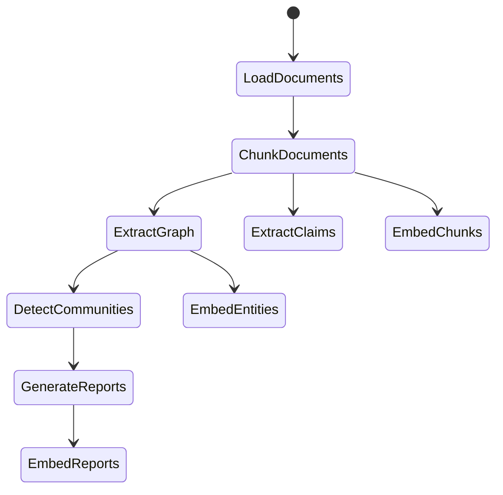

The GraphRAG indexing engine is built on several key architectural concepts that enable flexibility, extensibility, and reliability.

## Knowledge model

In order to support the GraphRAG system, the outputs of the indexing engine (in default configuration mode) are aligned to a knowledge model called the **GraphRAG Knowledge Model**.

<Info>
This model is designed to be an abstraction over the underlying data storage technology and provides a common interface for the GraphRAG system to interact with.
</Info>

The knowledge model consists of the following core entities:

- **Document** - An input document into the system (CSV rows or .txt files)
- **TextUnit** - A chunk of text to analyze
- **Entity** - An entity extracted from a TextUnit (people, places, events)
- **Relationship** - A relationship between two entities
- **Covariate** - Extracted claim information with time-bound statements
- **Community** - Hierarchical clustering of entities and relationships
- **Community Report** - Generated summaries of each community

## Workflows

The indexing pipeline is composed of individual workflows that execute in sequence. Below is the core GraphRAG indexing pipeline:



<Note>
Individual workflows are described in detail on the [dataflow](/indexing/dataflow) page.
</Note>

## LLM caching

The GraphRAG library was designed with LLM interactions in mind. A common setback when working with LLM APIs is various errors due to network latency, throttling, etc.

<Card title="How it works" icon="layer-group">
  When completion requests are made using the same input set (prompt and tuning parameters), the system returns a cached result if one exists. This allows the indexer to be:
  
  - **Resilient** to network issues
  - **Idempotent** across runs
  - **Efficient** for end-users
</Card>

## Providers and factories

Several subsystems within GraphRAG use a factory pattern to register and retrieve provider implementations. This allows deep customization to support your own implementations of models, storage, and more.

### Available factories

The following subsystems use a factory pattern that allows you to register your own implementations:

<AccordionGroup>
  <Accordion title="Language model" icon="brain">
    Implement your own `chat` and `embed` methods to use a model provider beyond the built-in LiteLLM wrapper.
    
    ```python
    # Location: graphrag/language_model/factory.py
    from graphrag.language_model.factory import LanguageModelFactory
    
    LanguageModelFactory.register(
        "custom_provider",
        MyCustomLanguageModel
    )
    ```
  </Accordion>
  
  <Accordion title="Input reader" icon="file-import">
    Implement your own input document reader to support file types other than text, CSV, and JSON.
    
    ```python
    # Location: graphrag/index/input/factory.py
    from graphrag.index.input.factory import InputReaderFactory
    
    InputReaderFactory.register(
        "pdf",
        MyPDFReader
    )
    ```
  </Accordion>
  
  <Accordion title="Cache" icon="database">
    Create your own cache storage location in addition to file, blob, and CosmosDB providers.
    
    ```python
    # Location: graphrag/cache/factory.py
    from graphrag.cache.factory import CacheFactory
    
    CacheFactory.register(
        "redis",
        MyRedisCache
    )
    ```
  </Accordion>
  
  <Accordion title="Logger" icon="file-lines">
    Create your own log writing location in addition to built-in file and blob storage.
    
    ```python
    # Location: graphrag/logger/factory.py
    from graphrag.logger.factory import LoggerFactory
    
    LoggerFactory.register(
        "cloudwatch",
        MyCloudWatchLogger
    )
    ```
  </Accordion>
  
  <Accordion title="Storage" icon="hard-drive">
    Create your own storage provider (database, etc.) beyond file, blob, and CosmosDB.
    
    ```python
    # Location: graphrag/storage/factory.py
    from graphrag.storage.factory import StorageFactory
    
    StorageFactory.register(
        "s3",
        MyS3Storage
    )
    ```
  </Accordion>
  
  <Accordion title="Vector store" icon="vector-square">
    Implement your own vector store beyond LanceDB, Azure AI Search, and CosmosDB.
    
    ```python
    # Location: graphrag/vector_stores/factory.py
    from graphrag.vector_stores.factory import VectorStoreFactory
    
    VectorStoreFactory.register(
        "pinecone",
        MyPineconeStore
    )
    ```
  </Accordion>
  
  <Accordion title="Pipeline + workflows" icon="diagram-project">
    Implement your own workflow steps with a custom `run_workflow` function, or register an entire pipeline.
    
    ```python
    # Location: graphrag/index/workflows/factory.py
    from graphrag.index.workflows.factory import PipelineFactory
    
    # Register a custom workflow
    PipelineFactory.register(
        "my_custom_workflow",
        my_workflow_function
    )
    
    # Register a custom pipeline
    PipelineFactory.register_pipeline(
        "my_pipeline",
        ["workflow_1", "workflow_2", "workflow_3"]
    )
    ```
  </Accordion>
</AccordionGroup>

<Tip>
All of these factories allow you to register an implementation using any string name you would like, even overriding built-in ones directly.
</Tip>

## Pipeline factory implementation

Here's how the pipeline factory works under the hood:

```python
from graphrag.index.workflows.factory import PipelineFactory
from graphrag.config.enums import IndexingMethod

class PipelineFactory:
    """A factory class for workflow pipelines."""

    workflows: dict[str, WorkflowFunction] = {}
    pipelines: dict[str, list[str]] = {}

    @classmethod
    def register(cls, name: str, workflow: WorkflowFunction):
        """Register a custom workflow function."""
        cls.workflows[name] = workflow

    @classmethod
    def register_pipeline(cls, name: str, workflows: list[str]):
        """Register a new pipeline method as a list of workflow names."""
        cls.pipelines[name] = workflows

    @classmethod
    def create_pipeline(
        cls,
        config: GraphRagConfig,
        method: IndexingMethod | str = IndexingMethod.Standard,
    ) -> Pipeline:
        """Create a pipeline generator."""
        workflows = config.workflows or cls.pipelines.get(method, [])
        return Pipeline([(name, cls.workflows[name]) for name in workflows])
```

## Default workflow configurations

<Tabs>
  <Tab title="Standard">
    ```python
    _standard_workflows = [
        "create_base_text_units",
        "create_final_documents",
        "extract_graph",
        "finalize_graph",
        "extract_covariates",
        "create_communities",
        "create_final_text_units",
        "create_community_reports",
        "generate_text_embeddings",
    ]
    
    PipelineFactory.register_pipeline(
        IndexingMethod.Standard,
        ["load_input_documents", *_standard_workflows]
    )
    ```
  </Tab>
  
  <Tab title="Fast">
    ```python
    _fast_workflows = [
        "create_base_text_units",
        "create_final_documents",
        "extract_graph_nlp",  # NLP-based extraction
        "prune_graph",
        "finalize_graph",
        "create_communities",
        "create_final_text_units",
        "create_community_reports_text",  # Text-based reports
        "generate_text_embeddings",
    ]
    
    PipelineFactory.register_pipeline(
        IndexingMethod.Fast,
        ["load_input_documents", *_fast_workflows]
    )
    ```
  </Tab>
</Tabs>

## Next steps

<CardGroup cols={2}>
  <Card title="Data flow" icon="arrow-right-arrow-left" href="/indexing/dataflow">
    Learn how data flows through the indexing pipeline
  </Card>
  
  <Card title="Custom graphs" icon="diagram-project" href="/indexing/custom-graphs">
    Bring your own existing graph data
  </Card>
</CardGroup>
