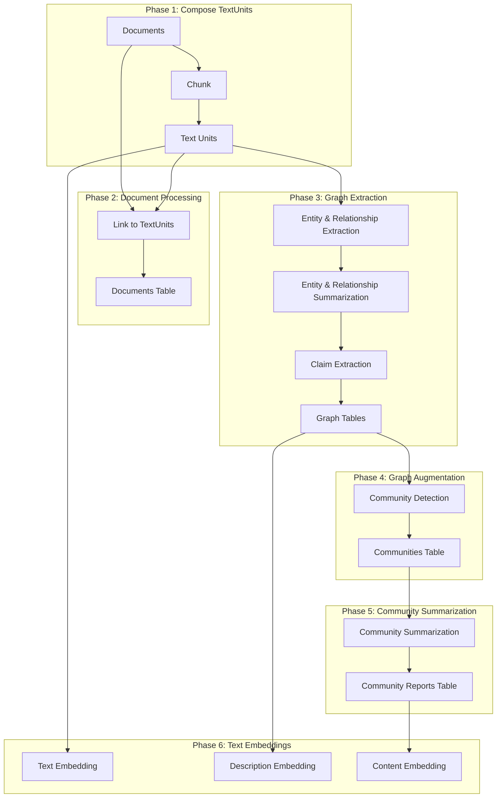
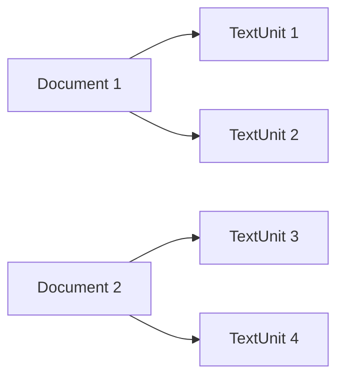
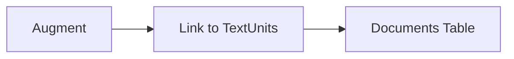
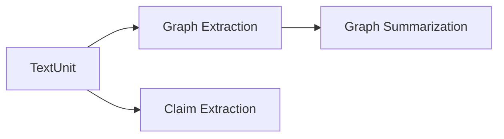
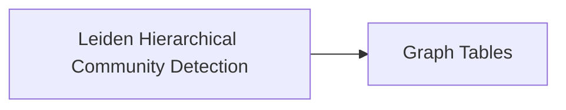
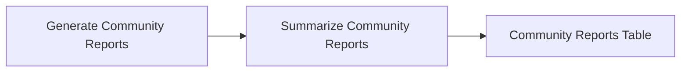
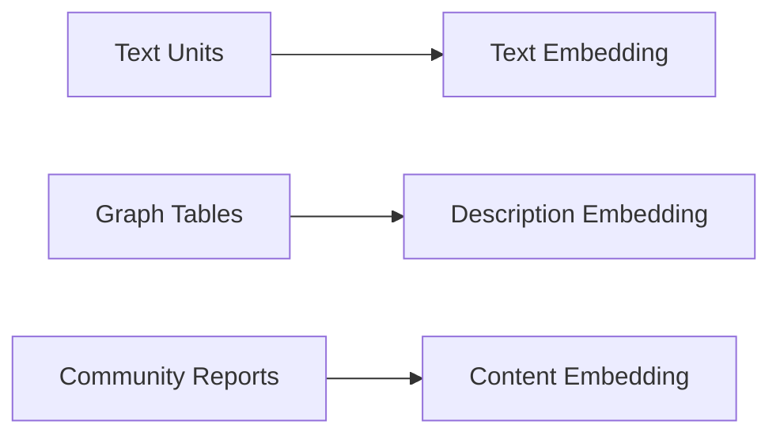

This page provides a detailed overview of how the default-configuration workflow transforms text documents into the GraphRAG Knowledge Model.

## Dataflow overview

The indexing pipeline consists of six major phases:



## Phase 1: Compose TextUnits

The first phase transforms input documents into **TextUnits**. A TextUnit is a chunk of text used for graph extraction techniques and source references.

<Info>
The chunk size (counted in tokens) is user-configurable. By default this is set to **1200 tokens**.
</Info>

### Chunking considerations

<CardGroup cols={2}>
  <Card title="Larger chunks" icon="up">
    - Lower-fidelity output
    - Less meaningful references
    - Much faster processing
  </Card>
  
  <Card title="Smaller chunks" icon="down">
    - Higher-fidelity output
    - More meaningful references
    - Slower processing
  </Card>
</CardGroup>



## Phase 2: Document processing

In this phase, the **Documents** table is created for the knowledge model. Documents are linked to their constituent text units for provenance tracking.



### Link to TextUnits

This step links each document to the text-units created in Phase 1, establishing bidirectional relationships between documents and their chunks.

## Phase 3: Graph extraction

In this phase, each text unit is analyzed to extract graph primitives: **Entities**, **Relationships**, and **Claims**.



<Warning>
If you are using [FastGraphRAG](/indexing/methods#fastgraphrag), entity and relationship extraction will be performed using NLP to conserve LLM resources, and claim extraction will always be skipped.
</Warning>

### Entity and relationship extraction

The first step processes each text-unit to extract entities and relationships using the LLM.

<Steps>
  <Step title="Extract from text units">
    Each text unit is processed to extract:
    - **Entities** with a title, type, and description
    - **Relationships** with a source, target, and description
  </Step>
  
  <Step title="Merge subgraphs">
    Subgraphs are merged together:
    - Entities with the same title and type are merged by creating an array of descriptions
    - Relationships with the same source and target are merged by creating an array of descriptions
  </Step>
</Steps>

```python
# From: graphrag/index/workflows/extract_graph.py
async def extract_graph(
    text_units: pd.DataFrame,
    callbacks: WorkflowCallbacks,
    extraction_model: "LLMCompletion",
    extraction_prompt: str,
    entity_types: list[str],
    max_gleanings: int,
    extraction_num_threads: int,
    extraction_async_type: AsyncType,
    summarization_model: "LLMCompletion",
    max_summary_length: int,
    max_input_tokens: int,
    summarization_prompt: str,
    summarization_num_threads: int,
) -> tuple[pd.DataFrame, pd.DataFrame, pd.DataFrame, pd.DataFrame]:
    """All the steps to create the base entity graph."""
    # Extract entities and relationships from text units
    extracted_entities, extracted_relationships = await extractor(
        text_units=text_units,
        callbacks=callbacks,
        text_column="text",
        id_column="id",
        model=extraction_model,
        prompt=extraction_prompt,
        entity_types=entity_types,
        max_gleanings=max_gleanings,
        num_threads=extraction_num_threads,
        async_type=extraction_async_type,
    )
```

### Entity and relationship summarization

Once the graph is built, each entity and relationship has a list of descriptions that are summarized into a single concise description using the LLM.

<Note>
This allows all entities and relationships to have a single concise description that captures all distinct information.
</Note>

### Claim extraction (optional)

Claims are extracted as an independent workflow from the source TextUnits. These claims represent positive factual statements with an evaluated status and time-bounds.

<Warning>
Claim extraction is **optional** and turned off by default. This feature generally requires prompt tuning to be useful for your specific use case.
</Warning>

The claims get exported as a primary artifact called **Covariates**.

## Phase 4: Graph augmentation

Now that we have a usable graph of entities and relationships, the system understands their community structure using hierarchical clustering.



### Community detection

This step generates a hierarchy of entity communities using the **Hierarchical Leiden Algorithm**.

<Info>
This method applies recursive community-clustering to the graph until reaching a community-size threshold. This provides a way to navigate and summarize the graph at different levels of granularity.
</Info>

```python
# From: graphrag/index/operations/cluster_graph.py
def cluster_graph(
    edges: pd.DataFrame,
    max_cluster_size: int,
    use_lcc: bool,
    seed: int | None = None,
) -> Communities:
    """Apply a hierarchical clustering algorithm to a relationships DataFrame."""
    node_id_to_community_map, parent_mapping = _compute_leiden_communities(
        edges=edges,
        max_cluster_size=max_cluster_size,
        use_lcc=use_lcc,
        seed=seed,
    )
    
    # Build community hierarchy
    levels = sorted(node_id_to_community_map.keys())
    clusters: dict[int, dict[int, list[str]]] = {}
    
    for level in levels:
        result: dict[int, list[str]] = defaultdict(list)
        clusters[level] = result
        for node_id, community_id in node_id_to_community_map[level].items():
            result[community_id].append(node_id)
    
    return results
```

### Graph tables

Once graph augmentation is complete, the final **Entities**, **Relationships**, and **Communities** tables are exported.

## Phase 5: Community summarization

Community reports are generated for each community in the hierarchy, providing high-level understanding at various levels of granularity.



### Generate community reports

A summary is generated for each community using the LLM. These reports contain:

<CardGroup cols={2}>
  <Card title="Executive overview" icon="file-lines">
    High-level summary of the community's content and significance
  </Card>
  
  <Card title="Key entities" icon="users">
    Reference to important entities within the community
  </Card>
  
  <Card title="Relationships" icon="link">
    Important connections between entities in the community
  </Card>
  
  <Card title="Claims" icon="flag">
    Relevant claims extracted from the community (if enabled)
  </Card>
</CardGroup>

### Summarize community reports

Each community report is then summarized via the LLM for shorthand use in queries.

### Community reports table

At this point, bookkeeping work is performed and the **Community Reports** table is exported.

## Phase 6: Text embedding

For all artifacts that require downstream vector search, text embeddings are generated as a final step.

<Info>
Embeddings are written directly to a configured vector store.
</Info>



### Default embedding targets

By default, the following are embedded:

- **Entity descriptions** - For entity-based vector search
- **Text unit text** - For chunk-based retrieval
- **Community report text** - For high-level semantic search

## Next steps

<CardGroup cols={2}>
  <Card title="Outputs" icon="table" href="/indexing/outputs">
    Learn about the Parquet output schemas
  </Card>
  
  <Card title="Methods" icon="flask" href="/indexing/methods">
    Compare Standard and FastGraphRAG indexing
  </Card>
  
  <Card title="Configuration" icon="gear" href="/configuration/overview">
    Configure chunk size, prompts, and more
  </Card>
</CardGroup>
