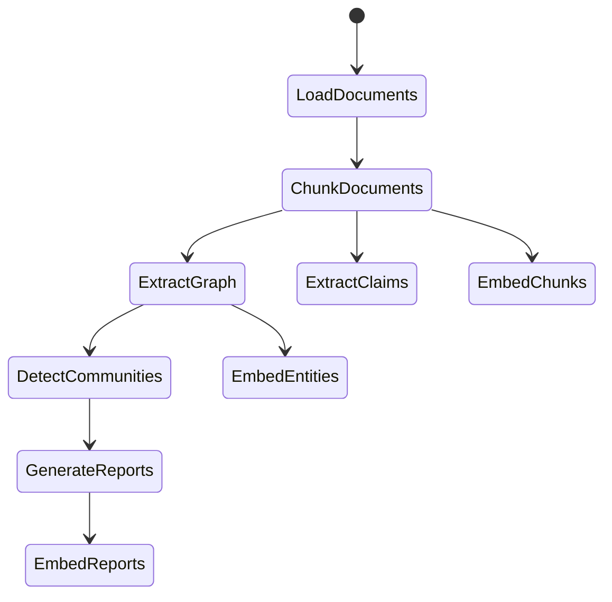

## What is GraphRAG?

GraphRAG is a data pipeline and transformation suite designed to extract meaningful, structured data from unstructured text using the power of Large Language Models (LLMs). Built by Microsoft Research, it represents a structured, hierarchical approach to Retrieval Augmented Generation (RAG), as opposed to naive semantic-search approaches using plain text snippets.

<Note>
  GraphRAG is an open-source project from Microsoft Research. Read the [research paper](https://arxiv.org/pdf/2404.16130) and [blog post](https://www.microsoft.com/en-us/research/blog/graphrag-unlocking-llm-discovery-on-narrative-private-data/) to learn more about the methodology.
</Note>

## How GraphRAG works

The GraphRAG process involves four key steps:

<Steps>
  <Step title="Extract knowledge graph">
    Extract entities, relationships, and key claims from your raw text documents to build a comprehensive knowledge graph.
  </Step>
  
  <Step title="Build community hierarchy">
    Use the Leiden algorithm to perform hierarchical clustering, organizing entities into meaningful semantic communities.
  </Step>
  
  <Step title="Generate summaries">
    Create bottom-up summaries for each community and its constituents to enable holistic understanding of your dataset.
  </Step>
  
  <Step title="Query with context">
    Leverage the structured graph and summaries to provide rich context for LLM queries, enabling sophisticated reasoning.
  </Step>
</Steps>

## GraphRAG vs baseline RAG

While traditional vector-based RAG (baseline RAG) uses semantic similarity search over text chunks, it struggles in two key scenarios:

<CardGroup cols={2}>
  <Card title="Connecting the dots" icon="link">
    Baseline RAG fails when answers require traversing disparate pieces of information through their shared attributes to synthesize new insights.
  </Card>
  
  <Card title="Holistic understanding" icon="chart-network">
    Baseline RAG performs poorly when asked to understand summarized semantic concepts over large data collections or singular large documents.
  </Card>
</CardGroup>

GraphRAG addresses these limitations by creating a knowledge graph with community summaries and graph machine learning outputs, demonstrating substantial improvements for complex reasoning tasks.

## Key capabilities

<CardGroup cols={2}>
  <Card title="Global search" icon="globe" href="/query/global-search">
    Reason about holistic questions by leveraging community summaries across your entire dataset.
  </Card>
  
  <Card title="Local search" icon="magnifying-glass" href="/query/local-search">
    Answer specific questions about entities by exploring their neighbors and associated concepts.
  </Card>
  
  <Card title="DRIFT search" icon="compass" href="/query/drift-search">
    Enhanced local search that includes community information for broader, more comprehensive answers.
  </Card>
  
  <Card title="Prompt tuning" icon="wand-magic-sparkles" href="/prompt-tuning/overview">
    Fine-tune extraction prompts to optimize GraphRAG performance for your specific data.
  </Card>
</CardGroup>

## The GraphRAG indexing pipeline

GraphRAG's indexing engine transforms your raw documents through a series of workflows:

<Tip>
  The pipeline includes LLM caching to ensure resilience against network issues and provide efficient, idempotent operations.
</Tip>

## Query modes

At query time, GraphRAG provides multiple search modes optimized for different question types:

- **Global Search** - Best for questions requiring understanding of the entire dataset (e.g., "What are the top themes?")
- **Local Search** - Best for questions about specific entities (e.g., "What are the healing properties of chamomile?")
- **DRIFT Search** - Enhanced local search with community context for comprehensive entity-based queries
- **Basic Search** - Standard vector RAG for comparison and baseline queries

## Use cases

GraphRAG excels at reasoning about private datasets - data that the LLM has never seen before:

- Enterprise research documents
- Business intelligence and reporting
- Legal document analysis
- Scientific literature review
- Customer feedback analysis
- Knowledge base construction

<Warning>
  GraphRAG indexing can be expensive in terms of LLM API calls. Start with small datasets to understand costs, and consider using faster/cheaper models during experimentation.
</Warning>

## Getting started

<CardGroup cols={3}>
  <Card title="Quickstart" icon="rocket" href="/quickstart">
    Get up and running with GraphRAG in minutes using our command-line quickstart guide.
  </Card>
  
  <Card title="Installation" icon="download" href="/installation">
    Detailed installation instructions and system requirements for all supported platforms.
  </Card>
  
  <Card title="Configuration" icon="gear" href="/configuration/overview">
    Learn how to configure GraphRAG for your specific data and use case.
  </Card>
</CardGroup>

## Architecture highlights

GraphRAG is built with extensibility and customization in mind:

- **Factory pattern** - Register custom implementations for models, storage, vector stores, and workflows
- **Provider support** - Built-in support for OpenAI, Azure OpenAI, and 100+ models via LiteLLM
- **Storage flexibility** - File, blob storage, and CosmosDB support out of the box
- **Vector store options** - LanceDB, Azure AI Search, and CosmosDB with extensible interface

## Community and support

<CardGroup cols={2}>
  <Card title="GitHub Discussions" icon="github" href="https://github.com/microsoft/graphrag/discussions">
    Join the conversation and get help from the community.
  </Card>
  
  <Card title="GitHub Issues" icon="bug" href="https://github.com/microsoft/graphrag/issues">
    Report bugs and request features.
  </Card>
</CardGroup>

<Note>
  GraphRAG is provided as demonstration code and is not an officially supported Microsoft product. Always review the [Responsible AI FAQ](https://github.com/microsoft/graphrag/blob/main/RAI_TRANSPARENCY.md) before deployment.
</Note>
