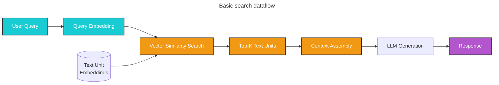

Basic search provides a rudimentary implementation of traditional vector RAG (Retrieval-Augmented Generation) to enable easy comparison with GraphRAG's advanced search methods.

## Overview

While GraphRAG's local, global, and DRIFT search methods leverage the knowledge graph structure, basic search implements a straightforward vector similarity search over raw text chunks. This allows you to compare different search results based on the type of question you're asking.

<Info>
**Purpose:** Basic search serves as a baseline to demonstrate the advantages of graph-based retrieval methods. It helps you understand when traditional RAG is sufficient and when GraphRAG's advanced methods provide significant value.
</Info>

## How it works

Basic search operates through a simple retrieval process:

### Vector similarity search

1. **Query embedding**: The user query is embedded using the same embedding model used for text units
2. **Similarity search**: Text units are ranked by semantic similarity to the query embedding
3. **Top-k selection**: The top `k` most similar text units are selected
4. **Context assembly**: Selected text units are concatenated to form the context

### Response generation

5. **Prompt construction**: A prompt is constructed with the retrieved text units as context
6. **LLM generation**: The LLM generates a response based on the context and query



## Configuration

The `BasicSearch` class accepts the following key parameters:

<ParamField path="model" type="LLMCompletion" required>
  Language model chat completion object for response generation
</ParamField>

<ParamField path="context_builder" type="BasicContextBuilder" required>
  Context builder for preparing context from text units
</ParamField>

<ParamField path="system_prompt" type="str">
  Prompt template for generating the search response. Default: `BASIC_SEARCH_SYSTEM_PROMPT`
</ParamField>

<ParamField path="response_type" type="str" default="multiple paragraphs">
  Free-form text describing the desired response format
</ParamField>

<ParamField path="tokenizer" type="Tokenizer">
  Token encoder for managing token budgets
</ParamField>

<ParamField path="model_params" type="dict">
  Additional parameters (e.g., temperature, max_tokens) passed to the LLM call
</ParamField>

<ParamField path="context_builder_params" type="dict">
  Additional parameters passed to the context builder. Common parameters:
  - `k`: Number of top text units to retrieve (default varies by configuration)
  - `max_context_tokens`: Maximum tokens for context window
</ParamField>

<ParamField path="callbacks" type="list[QueryCallbacks]">
  Optional callback functions for event handlers during execution
</ParamField>

## API usage

### Basic usage

```python
from graphrag.api import basic_search
from graphrag.config import GraphRagConfig
import pandas as pd

# Load your configuration
config = GraphRagConfig.from_file("settings.yaml")

# Load text units
text_units = pd.read_parquet("output/text_units.parquet")

# Perform basic search
response, context = await basic_search(
    config=config,
    text_units=text_units,
    response_type="Multiple Paragraphs",
    query="What are the main topics discussed in the documents?"
)

print(response)
```

### Streaming usage

```python
from graphrag.api import basic_search_streaming

# Stream the response
async for chunk in basic_search_streaming(
    config=config,
    text_units=text_units,
    response_type="Multiple Paragraphs",
    query="What are the main topics discussed in the documents?"
):
    print(chunk, end="", flush=True)
```

### Custom top-k configuration

```python
from graphrag.query.factory import get_basic_search_engine

# Create search engine with custom parameters
search_engine = get_basic_search_engine(
    config=config,
    text_units=text_units,
    text_unit_embeddings=embedding_store,
    response_type="List",
    context_builder_params={
        "k": 20,  # Retrieve top 20 text units
        "max_context_tokens": 6000
    }
)

result = await search_engine.search(query="Your question")
print(result.response)
```

## Performance considerations

### Top-k selection

The number of text units retrieved significantly impacts results:

<CodeGroup>
```python Low k (faster, cheaper)
context_params = {
    "k": 5,  # Only 5 chunks
    "max_context_tokens": 3000
}
```

```python Medium k (balanced)
context_params = {
    "k": 10,  # Default range
    "max_context_tokens": 6000
}
```

```python High k (comprehensive)
context_params = {
    "k": 20,  # More chunks for context
    "max_context_tokens": 10000
}
```
</CodeGroup>

### Embedding quality

Basic search performance depends heavily on embedding quality:

- **Embedding model**: Use the same model for queries and text units
- **Text unit size**: Chunk size affects granularity of retrieval
- **Semantic coverage**: Works best when query terms appear in text units

## Limitations

Basic search has several limitations compared to GraphRAG's advanced methods:

<Warning>
**Known limitations:**

1. **No structural understanding**: Cannot leverage entity relationships or community structure
2. **Limited aggregation**: Poor performance on questions requiring synthesis across multiple topics
3. **Semantic similarity bias**: Relies only on text similarity, not conceptual relationships
4. **No entity awareness**: Cannot reason about specific entities or their attributes
5. **Context fragmentation**: Retrieved chunks may not provide coherent context
</Warning>

### When basic search fails

<AccordionGroup>
  <Accordion title="Aggregation questions">
    **Question:** "What are the top 5 themes in the dataset?"
    
    **Why it fails:** Basic search cannot aggregate information across the entire dataset. It retrieves individual chunks but lacks the global view needed for thematic analysis.
    
    **Better approach:** Use [global search](/query/global-search)
  </Accordion>
  
  <Accordion title="Entity-specific questions">
    **Question:** "What is the relationship between Alice and Bob?"
    
    **Why it struggles:** While it might retrieve chunks mentioning both names, it cannot systematically identify and prioritize relationship information.
    
    **Better approach:** Use [local search](/query/local-search)
  </Accordion>
  
  <Accordion title="Multi-hop reasoning">
    **Question:** "How do collaborations between departments influence innovation?"
    
    **Why it struggles:** Cannot follow connections through the knowledge graph to build comprehensive context.
    
    **Better approach:** Use [DRIFT search](/query/drift-search)
  </Accordion>
</AccordionGroup>

## Comparison with GraphRAG methods

| Aspect | Basic Search | Local Search | Global Search | DRIFT Search |
|--------|-------------|--------------|---------------|-------------|
| **Retrieval** | Vector similarity | Entity + graph | Community reports | Hybrid iterative |
| **Structure** | None | Knowledge graph | Community hierarchy | Graph + hierarchy |
| **Context** | Text chunks | Entities + relationships + chunks | All community reports | Dynamic multi-level |
| **Aggregation** | Poor | Moderate | Excellent | Excellent |
| **Entity reasoning** | No | Yes | Limited | Yes |
| **Cost** | Lowest | Low-Medium | High | Medium-High |
| **Speed** | Fastest | Fast | Slow | Medium |

## Best practices

<Steps>
  <Step title="Use for baseline comparison">
    Run basic search alongside GraphRAG methods to quantify the improvement
  </Step>
  
  <Step title="Optimize text unit size">
    Ensure text units are appropriately sized during indexing (typically 300-500 tokens)
  </Step>
  
  <Step title="Start with moderate k">
    Begin with k=10 and adjust based on response quality
  </Step>
  
  <Step title="Monitor context relevance">
    Check the retrieved text units to ensure they're actually relevant to the query
  </Step>
  
  <Step title="Use for simple factual queries">
    Basic search can be sufficient for straightforward questions with clear keywords
  </Step>
</Steps>

## Examples

### Simple factual query

```python
# Basic search works well for straightforward factual questions
response, context = await basic_search(
    config=config,
    text_units=text_units,
    query="What is the population of Tokyo?",
    response_type="Single Paragraph"
)
```

### Comparison with local search

```python
from graphrag.api import basic_search, local_search

query = "What are the healing properties of chamomile?"

# Basic search
basic_response, _ = await basic_search(
    config=config,
    text_units=text_units,
    query=query
)

# Local search
local_response, _ = await local_search(
    config=config,
    entities=entities,
    communities=communities,
    community_reports=community_reports,
    text_units=text_units,
    relationships=relationships,
    covariates=covariates,
    community_level=2,
    query=query
)

print("Basic Search:", basic_response)
print("\nLocal Search:", local_response)
```

### Evaluating search quality

```python
import time

query = "What are the main research themes?"

# Benchmark basic search
start = time.time()
basic_response, basic_context = await basic_search(
    config=config,
    text_units=text_units,
    query=query
)
basic_time = time.time() - start

# Benchmark global search
start = time.time()
global_response, global_context = await global_search(
    config=config,
    entities=entities,
    communities=communities,
    community_reports=community_reports,
    community_level=2,
    query=query
)
global_time = time.time() - start

print(f"Basic Search: {basic_time:.2f}s")
print(f"Global Search: {global_time:.2f}s")
print(f"\nQuality difference evident: Global search provides" 
      f" structured themes vs. basic similarity matches")
```

## When to use basic search

Basic search is appropriate when:

<Check>
- You need a baseline for comparison
- Your question contains specific keywords likely to appear in text
- You're doing simple fact lookup
- You want the fastest possible response time
- Your dataset doesn't have complex entity relationships
- Cost optimization is critical and quality requirements are low
</Check>

## Next steps

<CardGroup cols={2}>
  <Card title="Local search" icon="location-dot" href="/query/local-search">
    Learn about entity-based graph search
  </Card>
  <Card title="Global search" icon="globe" href="/query/global-search">
    Understand dataset-wide reasoning
  </Card>
  <Card title="DRIFT search" icon="compass" href="/query/drift-search">
    Explore hybrid iterative search
  </Card>
  <Card title="Query configuration" icon="gear" href="/query/overview">
    Configure search parameters
  </Card>
</CardGroup>