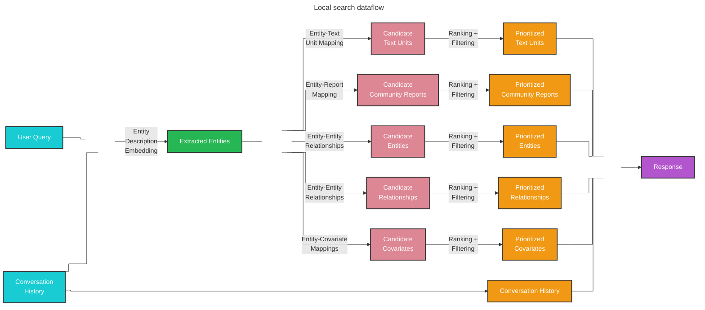

Local search generates answers by combining relevant data from the AI-extracted knowledge graph with text chunks of raw documents. This method is ideal for questions requiring understanding of specific entities mentioned in the documents.

## Overview

The local search method combines structured data from the knowledge graph with unstructured data from input documents to augment the LLM context with relevant entity information at query time.

<Info>
**Example use case:** "What are the healing properties of chamomile?"

Local search excels at questions requiring detailed understanding of specific entities and their relationships.
</Info>

## How it works

Local search operates through a multi-step retrieval and ranking process:

### Entity extraction

Given a user query and optional conversation history, local search identifies entities from the knowledge graph that are semantically related to the user input using entity description embeddings.

### Context building

The identified entities serve as access points into the knowledge graph, enabling extraction of:

- **Connected entities**: Related entities with their attributes
- **Relationships**: Edges connecting entities with relationship metadata
- **Entity covariates**: Additional structured data associated with entities
- **Community reports**: Summaries of entity communities
- **Text units**: Raw text chunks from source documents associated with the entities

### Prioritization and filtering

Candidate data sources are ranked and filtered to fit within a single context window of pre-defined size. This ensures the most relevant information is included in the prompt.



## Configuration

The `LocalSearch` class accepts the following key parameters:

<ParamField path="model" type="LLMCompletion" required>
  Language model chat completion object for response generation
</ParamField>

<ParamField path="context_builder" type="LocalContextBuilder" required>
  Context builder object for preparing context data from knowledge model objects
</ParamField>

<ParamField path="system_prompt" type="str">
  Prompt template for generating the search response. Default: `LOCAL_SEARCH_SYSTEM_PROMPT`
</ParamField>

<ParamField path="response_type" type="str" default="multiple paragraphs">
  Free-form text describing the desired response format (e.g., "Multiple Paragraphs", "Single Paragraph", "List")
</ParamField>

<ParamField path="llm_params" type="dict">
  Additional parameters (e.g., temperature, max_tokens) passed to the LLM call
</ParamField>

<ParamField path="context_builder_params" type="dict">
  Additional parameters passed to the context builder when building context for the search prompt. Common parameters:
  - `text_unit_prop`: Proportion of context window for text units
  - `community_prop`: Proportion of context window for community reports
  - `top_k_mapped_entities`: Number of top entities to include
  - `top_k_relationships`: Number of top relationships to include
  - `include_entity_rank`: Include entity importance scores
  - `include_relationship_weight`: Include relationship weights
  - `max_context_tokens`: Maximum tokens for context
</ParamField>

<ParamField path="callbacks" type="list[QueryCallbacks]">
  Optional callback functions for custom event handlers during LLM completion streaming
</ParamField>

## API usage

### Basic usage

```python
from graphrag.api import local_search
from graphrag.config import GraphRagConfig
import pandas as pd

# Load your configuration
config = GraphRagConfig.from_file("settings.yaml")

# Load your indexed data
entities = pd.read_parquet("output/entities.parquet")
communities = pd.read_parquet("output/communities.parquet")
community_reports = pd.read_parquet("output/community_reports.parquet")
text_units = pd.read_parquet("output/text_units.parquet")
relationships = pd.read_parquet("output/relationships.parquet")
covariates = pd.read_parquet("output/covariates.parquet")

# Perform local search
response, context = await local_search(
    config=config,
    entities=entities,
    communities=communities,
    community_reports=community_reports,
    text_units=text_units,
    relationships=relationships,
    covariates=covariates,
    community_level=2,
    response_type="Multiple Paragraphs",
    query="What are the healing properties of chamomile?"
)

print(response)
```

### Streaming usage

```python
from graphrag.api import local_search_streaming

# Stream the response
async for chunk in local_search_streaming(
    config=config,
    entities=entities,
    communities=communities,
    community_reports=community_reports,
    text_units=text_units,
    relationships=relationships,
    covariates=covariates,
    community_level=2,
    response_type="Multiple Paragraphs",
    query="What are the healing properties of chamomile?"
):
    print(chunk, end="", flush=True)
```

### Advanced configuration

```python
# Use advanced context builder parameters
from graphrag.query.factory import get_local_search_engine

search_engine = get_local_search_engine(
    config=config,
    # ... data parameters
    context_builder_params={
        "text_unit_prop": 0.5,  # 50% of context for text units
        "community_prop": 0.3,  # 30% for community reports
        "top_k_mapped_entities": 15,  # Top 15 entities
        "top_k_relationships": 20,  # Top 20 relationships
        "include_entity_rank": True,
        "include_relationship_weight": True,
        "max_context_tokens": 8000
    }
)

result = await search_engine.search(query="Your question here")
```

## Performance considerations

### Context window optimization

Local search performance depends heavily on context window composition:

<Tip>
**Balance text units and community reports:** Adjust `text_unit_prop` and `community_prop` to find the optimal mix for your use case.
- More text units: Better for specific, detailed questions
- More community reports: Better for broader entity context
</Tip>

```python
# For detailed, specific questions
context_params = {
    "text_unit_prop": 0.6,
    "community_prop": 0.2,
}

# For broader context questions
context_params = {
    "text_unit_prop": 0.3,
    "community_prop": 0.5,
}
```

### Entity extraction quality

The quality of entity extraction directly impacts search results:

- **Embedding model**: Use high-quality embedding models for entity descriptions
- **Entity descriptions**: Ensure entities have rich, descriptive text during indexing
- **Top-k tuning**: Adjust `top_k_mapped_entities` based on query complexity

### Token budget

Manage token usage to balance quality and cost:

```python
# Larger context for complex questions
context_params = {"max_context_tokens": 12000}

# Smaller context for simple questions or cost optimization
context_params = {"max_context_tokens": 5000}
```

## Best practices

<Steps>
  <Step title="Start with entity-rich queries">
    Local search performs best when queries mention specific entities or concepts
  </Step>
  
  <Step title="Tune context proportions">
    Experiment with `text_unit_prop` and `community_prop` to optimize for your domain
  </Step>
  
  <Step title="Use conversation history">
    Include conversation history for follow-up questions to maintain context
  </Step>
  
  <Step title="Monitor context usage">
    Check the `context_data` in responses to understand what information was retrieved
  </Step>
  
  <Step title="Adjust top-k parameters">
    Increase `top_k_mapped_entities` and `top_k_relationships` for complex multi-entity questions
  </Step>
</Steps>

## Examples

### Entity-specific question

```python
response, context = await local_search(
    config=config,
    # ... data parameters
    query="What is the relationship between Alice and Bob?",
    response_type="Multiple Paragraphs"
)
```

### Multi-entity question

```python
response, context = await local_search(
    config=config,
    # ... data parameters
    query="How do the research interests of Dr. Smith, Dr. Jones, and Dr. Williams overlap?",
    response_type="List"
)
```

### Follow-up question with conversation history

```python
from graphrag.query.context_builder.conversation_history import ConversationHistory

# First question
response1, _ = await local_search(
    config=config,
    # ... data parameters
    query="What are the main research areas of Dr. Smith?"
)

# Follow-up question
history = ConversationHistory()
history.add_turn(user="What are the main research areas of Dr. Smith?", assistant=response1)

response2, _ = await local_search(
    config=config,
    # ... data parameters
    query="What publications has she authored in those areas?",
    conversation_history=history
)
```

## Comparison with global search

| Aspect | Local Search | Global Search |
|--------|-------------|---------------|
| **Use case** | Specific entity questions | Dataset-wide questions |
| **Starting point** | Entity embeddings | Community reports |
| **Context** | Entity neighborhood | All community reports |
| **Speed** | Faster | Slower |
| **Cost** | Lower | Higher |
| **Best for** | "What/who/where" questions | "Top-N", theme analysis |

## Next steps

<CardGroup cols={2}>
  <Card title="Global search" icon="globe" href="/query/global-search">
    Learn about dataset-wide reasoning
  </Card>
  <Card title="DRIFT search" icon="compass" href="/query/drift-search">
    Explore hybrid search methods
  </Card>
  <Card title="Example notebooks" icon="book-open" href="/examples/notebooks/local-search">
    See local search in action
  </Card>
  <Card title="Configuration" icon="gear" href="/query/overview">
    Configure local search settings
  </Card>
</CardGroup>