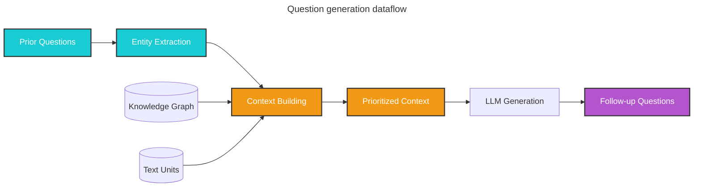

Question generation takes a list of user queries and generates candidate follow-up questions, enabling conversational exploration and deeper investigation of your dataset.

## Overview

The question generation method combines structured data from the knowledge graph with unstructured data from input documents to generate candidate questions related to specific entities. This is useful for:

- **Conversational AI**: Generating follow-up questions in multi-turn conversations
- **Guided exploration**: Creating question lists for investigators to dive deeper into datasets
- **Content discovery**: Surfacing important themes and topics for further investigation
- **Interactive dashboards**: Suggesting next questions based on user interests

<Info>
Question generation uses the same context-building approach as [local search](/query/local-search), ensuring that generated questions are grounded in actual data from the knowledge graph.
</Info>

## How it works

Question generation follows a similar pipeline to local search:

### Context building

Given a list of prior user questions, the method:

1. **Extracts entities**: Identifies relevant entities from the knowledge graph using embeddings
2. **Builds context**: Retrieves and prioritizes:
   - Entities and their attributes
   - Relationships between entities
   - Entity covariates (claims, facts)
   - Community reports
   - Raw text chunks from source documents
3. **Fits context**: Ensures all data fits within a single LLM prompt

### Question generation

4. **Generates candidates**: Uses the LLM to generate follow-up questions that:
   - Represent the most important or urgent information in the data
   - Relate to themes and content in the context
   - Build on prior questions
   - Are specific and actionable



## Configuration

The question generation class accepts the following key parameters:

<ParamField path="model" type="LLMCompletion" required>
  Language model chat completion object for question generation
</ParamField>

<ParamField path="context_builder" type="LocalContextBuilder" required>
  Context builder object for preparing context data from knowledge model objects. Uses the same context builder class as local search.
</ParamField>

<ParamField path="system_prompt" type="str">
  Prompt template for generating candidate questions. Default: `QUESTION_GEN_SYSTEM_PROMPT`
</ParamField>

<ParamField path="llm_params" type="dict">
  Additional parameters (e.g., temperature, max_tokens) passed to the LLM call. Higher temperature often produces more diverse questions.
</ParamField>

<ParamField path="context_builder_params" type="dict">
  Additional parameters passed to the context builder when building context. Supports the same parameters as local search:
  - `text_unit_prop`: Proportion of context for text units
  - `community_prop`: Proportion for community reports
  - `top_k_mapped_entities`: Number of top entities to include
  - `top_k_relationships`: Number of top relationships to include
  - `max_context_tokens`: Maximum tokens for context
</ParamField>

<ParamField path="callbacks" type="list[QueryCallbacks]">
  Optional callback functions for custom event handlers
</ParamField>

## Usage

### Basic question generation

```python
from graphrag.query.question_gen.local_gen import LocalQuestionGen
from graphrag.query.context_builder.builders import LocalContextBuilder
from graphrag_llm.completion import get_llm_completion

# Initialize the question generator
model = get_llm_completion(config)
context_builder = LocalContextBuilder(
    entities=entities,
    relationships=relationships,
    reports=community_reports,
    text_units=text_units,
    # ... other required parameters
)

question_gen = LocalQuestionGen(
    model=model,
    context_builder=context_builder,
    system_prompt=custom_prompt,  # Optional
    llm_params={"temperature": 0.7, "max_tokens": 500}
)

# Generate questions based on prior queries
prior_questions = [
    "What are the main research areas in the dataset?",
    "Who are the key researchers?"
]

follow_up_questions = await question_gen.generate(
    prior_questions=prior_questions,
    num_questions=5
)

for i, question in enumerate(follow_up_questions, 1):
    print(f"{i}. {question}")
```

### Integration with local search

```python
from graphrag.api import local_search
from graphrag.query.question_gen.local_gen import LocalQuestionGen

# Start with an initial question
initial_query = "What are the healing properties of chamomile?"

response, context = await local_search(
    config=config,
    entities=entities,
    communities=communities,
    community_reports=community_reports,
    text_units=text_units,
    relationships=relationships,
    covariates=covariates,
    community_level=2,
    query=initial_query
)

print("Answer:", response)
print("\n" + "="*50)

# Generate follow-up questions
question_gen = LocalQuestionGen(
    model=model,
    context_builder=context_builder,
    llm_params={"temperature": 0.8}  # Higher for diverse questions
)

follow_ups = await question_gen.generate(
    prior_questions=[initial_query],
    num_questions=5
)

print("\nSuggested follow-up questions:")
for i, q in enumerate(follow_ups, 1):
    print(f"{i}. {q}")
```

### Conversational exploration loop

```python
from graphrag.query.context_builder.conversation_history import ConversationHistory

async def conversational_exploration(
    initial_query: str,
    num_turns: int = 3,
    questions_per_turn: int = 3
):
    """Explore a topic through iterative Q&A."""
    
    conversation_history = ConversationHistory()
    current_query = initial_query
    all_questions = [initial_query]
    
    for turn in range(num_turns):
        print(f"\n{'='*60}")
        print(f"Turn {turn + 1}: {current_query}")
        print(f"{'='*60}")
        
        # Answer the current question
        response, _ = await local_search(
            config=config,
            entities=entities,
            communities=communities,
            community_reports=community_reports,
            text_units=text_units,
            relationships=relationships,
            covariates=covariates,
            community_level=2,
            query=current_query,
            conversation_history=conversation_history
        )
        
        print(f"\nAnswer: {response}")
        
        # Update conversation history
        conversation_history.add_turn(
            user=current_query,
            assistant=response
        )
        
        # Generate follow-up questions
        follow_ups = await question_gen.generate(
            prior_questions=all_questions,
            num_questions=questions_per_turn
        )
        
        print(f"\nFollow-up questions:")
        for i, q in enumerate(follow_ups, 1):
            print(f"{i}. {q}")
        
        # Select next question (could be user input or automatic)
        if follow_ups and turn < num_turns - 1:
            current_query = follow_ups[0]  # Automatically pick first
            all_questions.append(current_query)
    
    return conversation_history

# Run conversational exploration
await conversational_exploration(
    initial_query="What are the main themes in medical research?",
    num_turns=3
)
```

### Custom prompt for specific domains

```python
CUSTOM_QUESTION_PROMPT = """
---Role---
You are a scientific research assistant helping to explore a medical research dataset.

---Goal---
Generate insightful follow-up questions that would help a researcher understand:
- Novel discoveries or findings
- Experimental methodologies
- Relationships between different studies
- Gaps in the research

---Context Data---
{context_data}

---Prior Questions---
{prior_questions}

---Instructions---
Generate {num_questions} follow-up questions that:
1. Build on the prior questions
2. Are specific and answerable from the dataset
3. Focus on scientific insights and methodological details
4. Help identify important patterns or anomalies

Return ONLY the questions, one per line, numbered.
"""

question_gen = LocalQuestionGen(
    model=model,
    context_builder=context_builder,
    system_prompt=CUSTOM_QUESTION_PROMPT,
    llm_params={"temperature": 0.7}
)
```

## Best practices

<Steps>
  <Step title="Use higher temperature for diversity">
    Set `temperature` to 0.7-0.9 to generate more diverse and creative questions
  </Step>
  
  <Step title="Provide rich context">
    Ensure the context builder has access to comprehensive entity and relationship data
  </Step>
  
  <Step title="Customize prompts for your domain">
    Tailor the system prompt to guide question generation for your specific use case
  </Step>
  
  <Step title="Track question history">
    Maintain a list of all prior questions to avoid repetition and ensure progression
  </Step>
  
  <Step title="Filter and rank generated questions">
    Post-process questions to remove duplicates or low-quality candidates
  </Step>
</Steps>

## Advanced techniques

### Question ranking and filtering

```python
from typing import List
import re

def filter_questions(
    questions: List[str],
    prior_questions: List[str],
    min_length: int = 10,
    max_length: int = 150
) -> List[str]:
    """Filter out low-quality or duplicate questions."""
    
    filtered = []
    prior_set = {q.lower().strip() for q in prior_questions}
    
    for q in questions:
        q = q.strip()
        
        # Remove numbering if present
        q = re.sub(r'^\d+\.\s*', '', q)
        
        # Check length
        if not (min_length <= len(q) <= max_length):
            continue
        
        # Check for duplicates
        if q.lower() in prior_set:
            continue
        
        # Check if it's actually a question
        if not q.endswith('?'):
            q += '?'
        
        filtered.append(q)
    
    return filtered

# Use with question generation
raw_questions = await question_gen.generate(
    prior_questions=prior_questions,
    num_questions=10
)

filtered_questions = filter_questions(
    questions=raw_questions,
    prior_questions=prior_questions
)
```

### Thematic question organization

```python
from collections import defaultdict
import asyncio

async def generate_thematic_questions(
    themes: List[str],
    questions_per_theme: int = 3
) -> dict[str, List[str]]:
    """Generate questions organized by theme."""
    
    thematic_questions = defaultdict(list)
    
    for theme in themes:
        # Generate questions for each theme
        questions = await question_gen.generate(
            prior_questions=[f"What is known about {theme}?"],
            num_questions=questions_per_theme
        )
        thematic_questions[theme] = questions
    
    return dict(thematic_questions)

# Example usage
themes = [
    "cancer immunotherapy",
    "clinical trial outcomes",
    "drug interactions"
]

thematic_q = await generate_thematic_questions(themes)

for theme, questions in thematic_q.items():
    print(f"\n{theme.upper()}:")
    for i, q in enumerate(questions, 1):
        print(f"  {i}. {q}")
```

## Use cases

<CardGroup cols={2}>
  <Card title="Research exploration" icon="flask">
    Guide researchers through datasets by suggesting relevant questions based on their inquiry path
  </Card>
  <Card title="Chatbot interfaces" icon="comments">
    Power conversational interfaces with contextually relevant follow-up questions
  </Card>
  <Card title="Data investigation" icon="magnifying-glass-chart">
    Help investigators discover hidden patterns by suggesting unexplored angles
  </Card>
  <Card title="Training data generation" icon="database">
    Generate question-answer pairs for fine-tuning or evaluation datasets
  </Card>
</CardGroup>

## Next steps

<CardGroup cols={2}>
  <Card title="Local search" icon="location-dot" href="/query/local-search">
    Learn about entity-based search that powers question generation
  </Card>
  <Card title="Conversation history" icon="clock-rotate-left" href="/query/local-search#conversation-history">
    Manage multi-turn conversations
  </Card>
  <Card title="Example notebooks" icon="book-open" href="/examples/notebooks/local-search">
    See question generation in action
  </Card>
  <Card title="Custom prompts" icon="pen-to-square" href="/prompt-tuning/overview">
    Customize prompts for your domain
  </Card>
</CardGroup>